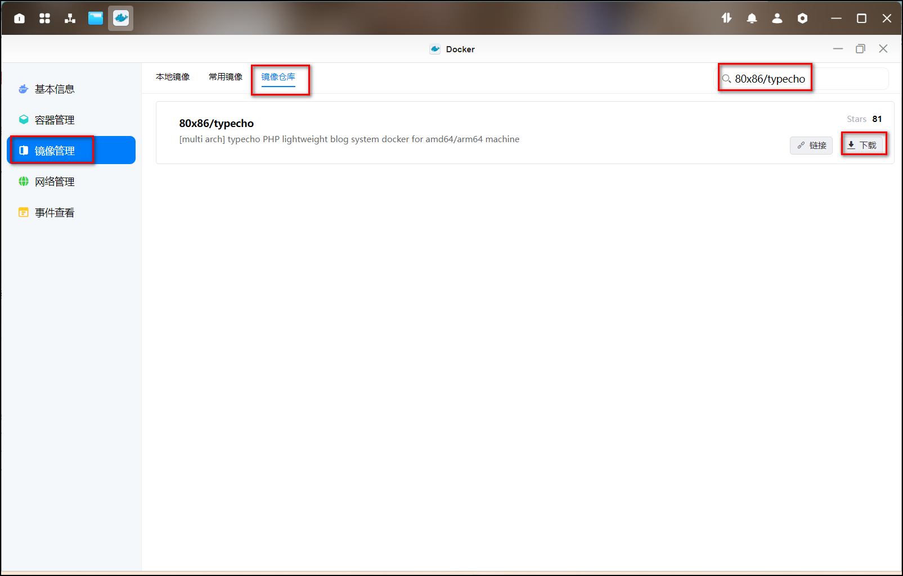
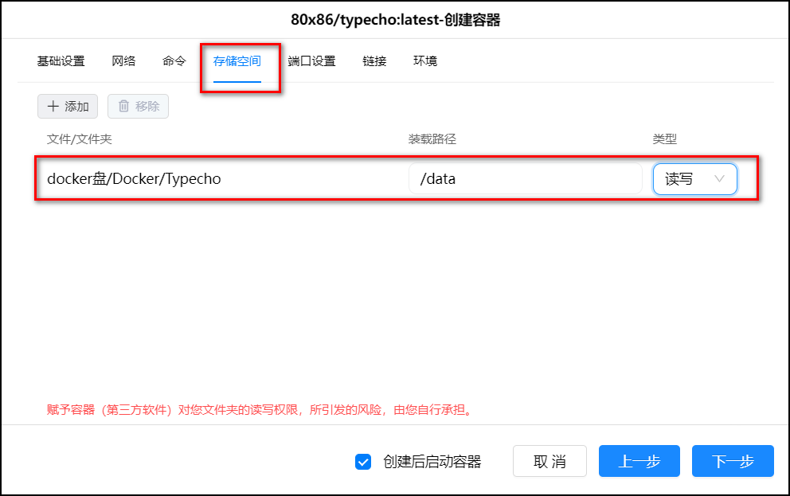
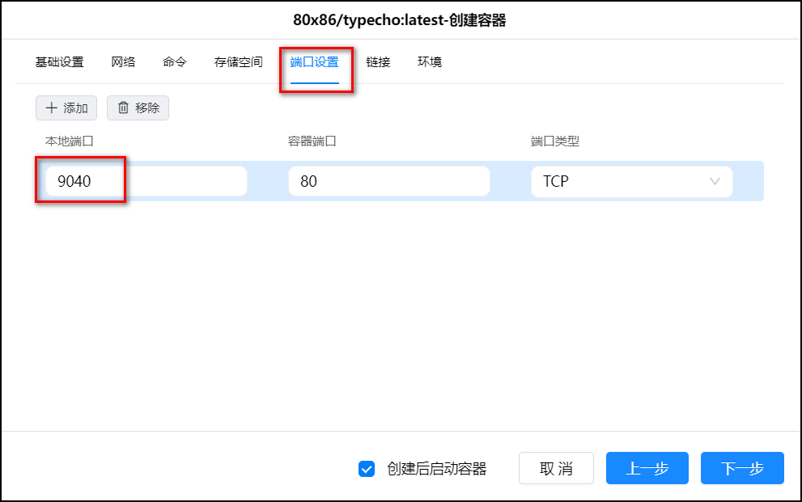
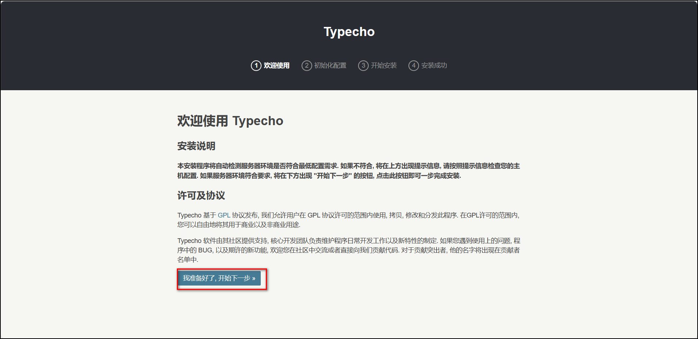
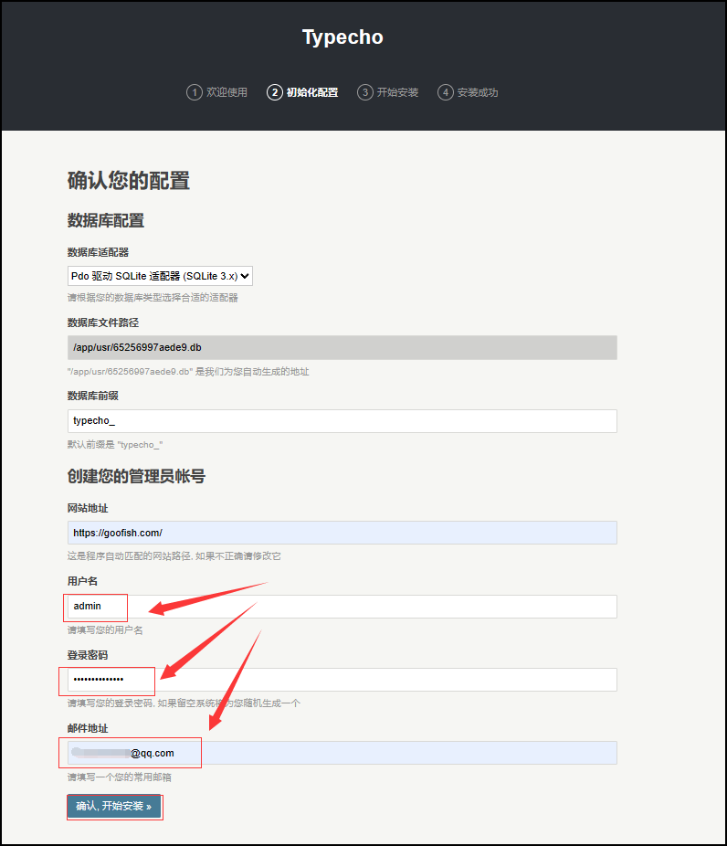
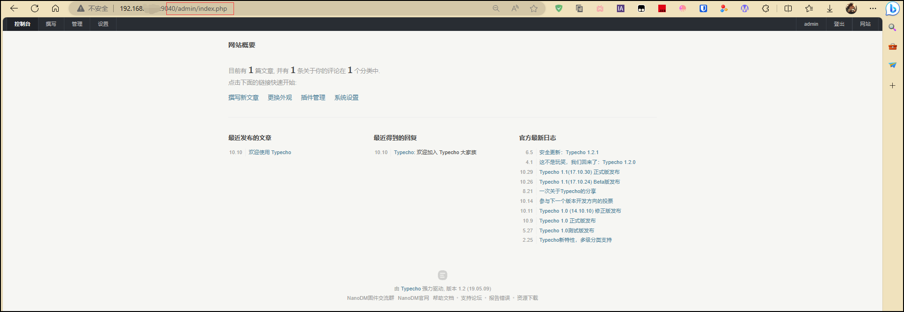
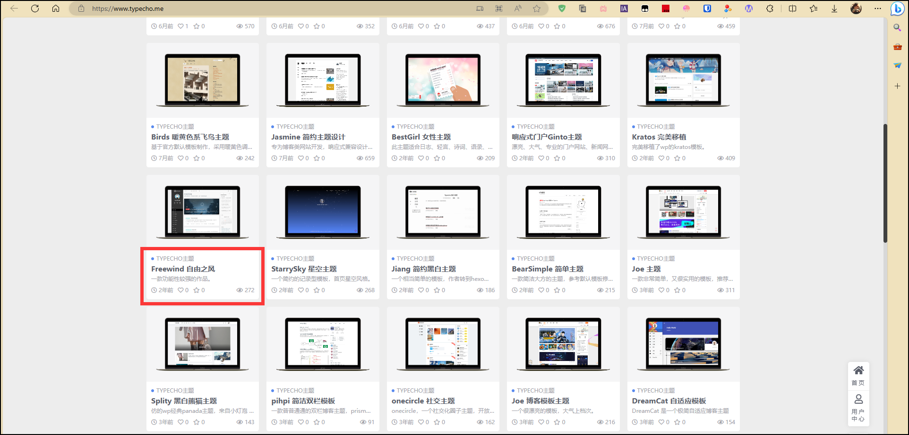
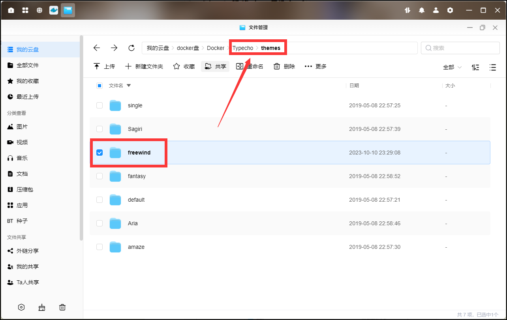
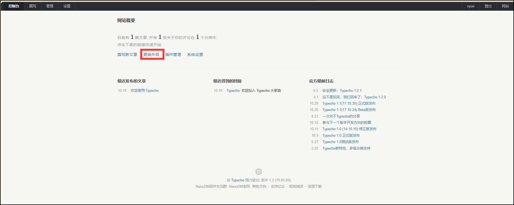
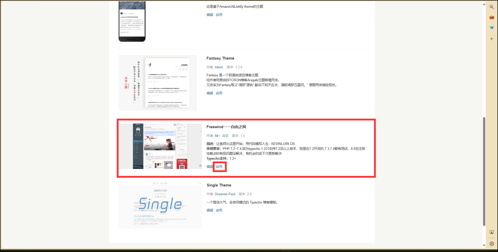

## 容器部署

1、绿联打开 Docker，搜索【80x86/typecho】，点击下载最新版本。

2、创建容器

1）存储空间：在 Docker 文件夹下新建一个 Typecho 文件夹，把它挂载，装载路径填/data

2）端口：本地端口填写个未被占用的端口比如 9040。

## 初始化

1、我们打开浏览器输入 IP:9040，打开我们的 Typecho 博客安装程序，点下一步。

2、自定义自己的管理账号密码，填上自己的常用邮箱，然后点开始安装。

3、等待一分钟后网页创建完毕后输入 IP:9040/admin/index.php，进入自己的博客控制台。在控制台里我们可以自行设置我们的所有插件、设置和主题外观。

## 主题

主题模板网址：https://www.typecho.me/

比如这个主题：

下载完成之后把主题文件解压粘贴到 Docker 盘 Typecho 文件夹下的 themes 文件夹内。

然后刷新一下我们的博客控制台，点击更改外观。

点击启用后就可以启用我们的主题了。

