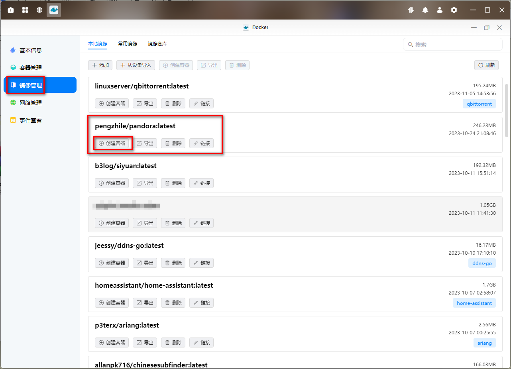
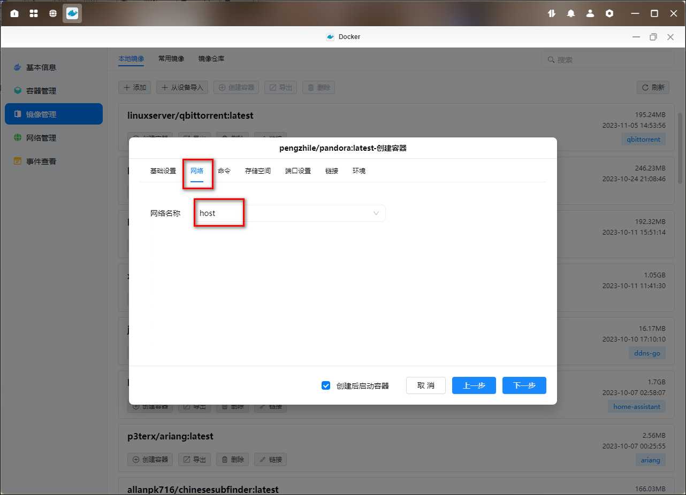
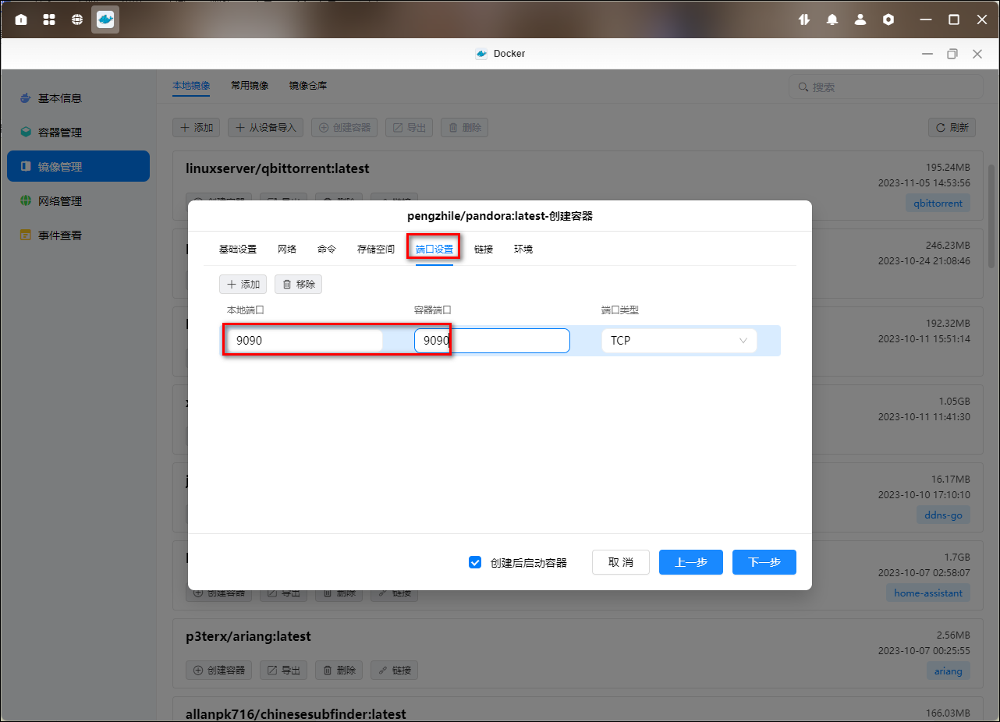
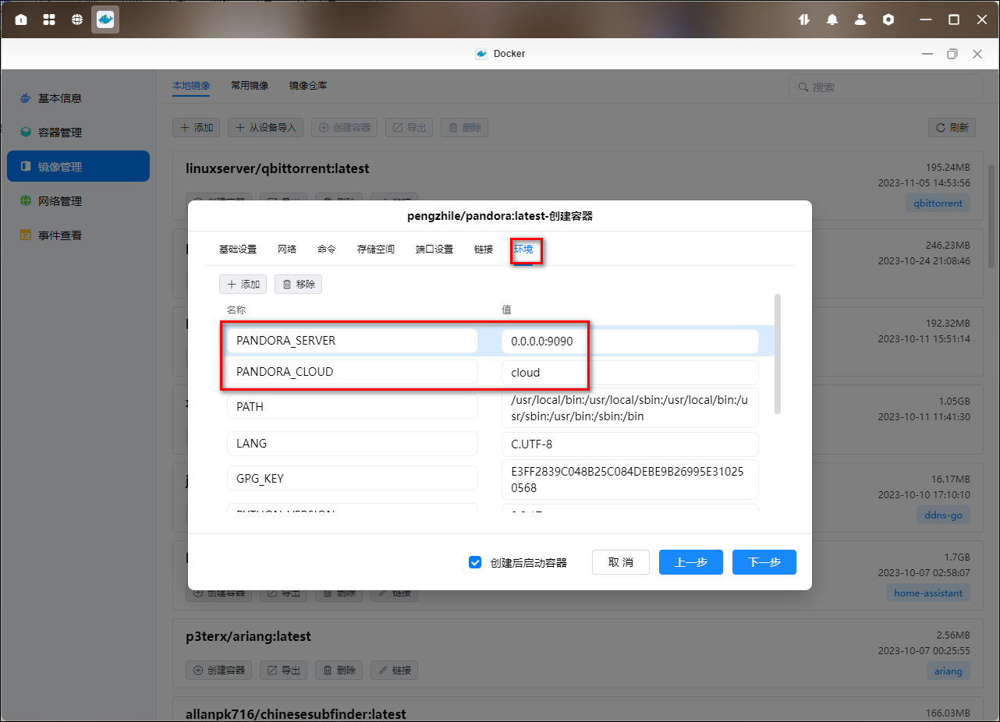
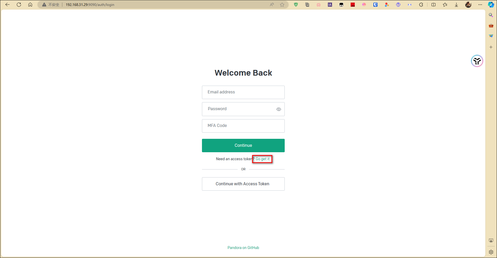
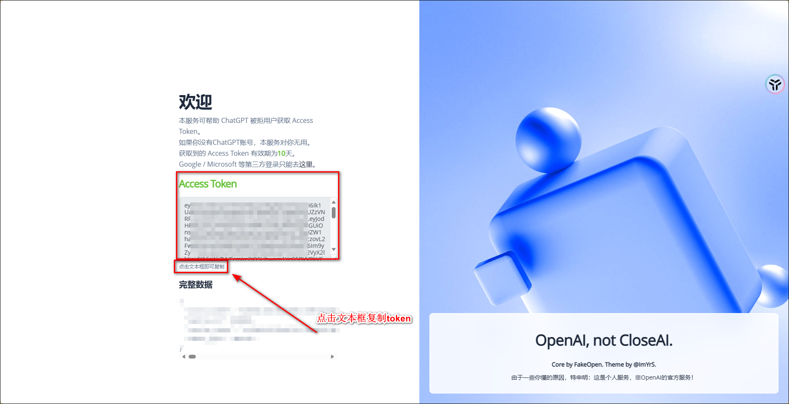
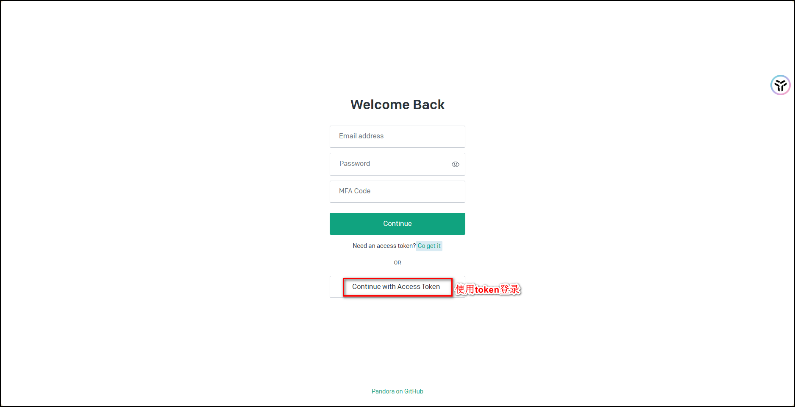

官网：<https://hub.docker.com/r/pengzhile/pandora>

## 1、docker 部署

1、下载好 pengzhile/pandora 镜像后，点击创建容器

2、网络选择 host

3、设置存储空间

4、设置端口

5、环境设置

## 2、网页部署

1、输入绿联 IP:端口进入网页，点击 go get it 去获取 token。

2、点击直接登录

3、输入注册的账号密码，然后点击获取

4、点击文本信息复制 token

5、选择使用 token 登录

6、登陆后就可以使用了

