## 1、容器部署

1）在绿联云的镜像仓库搜索 vaultwarden，下载最新版本。

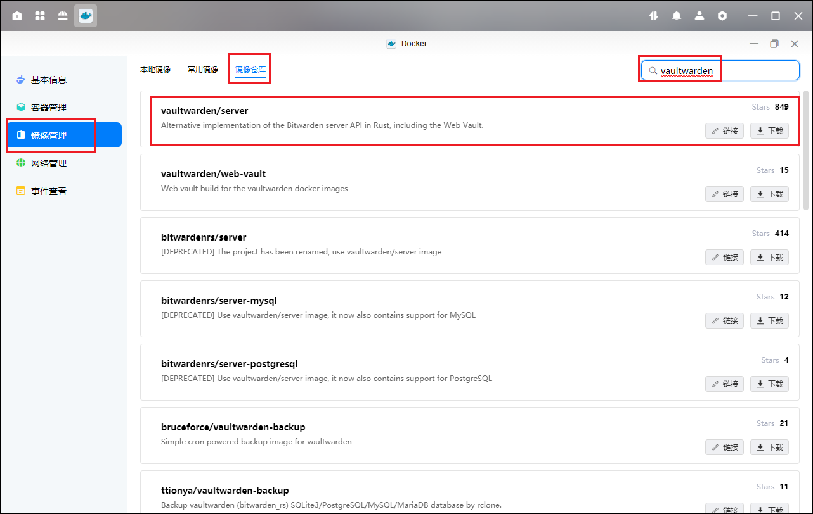

2）创建容器

基础设置

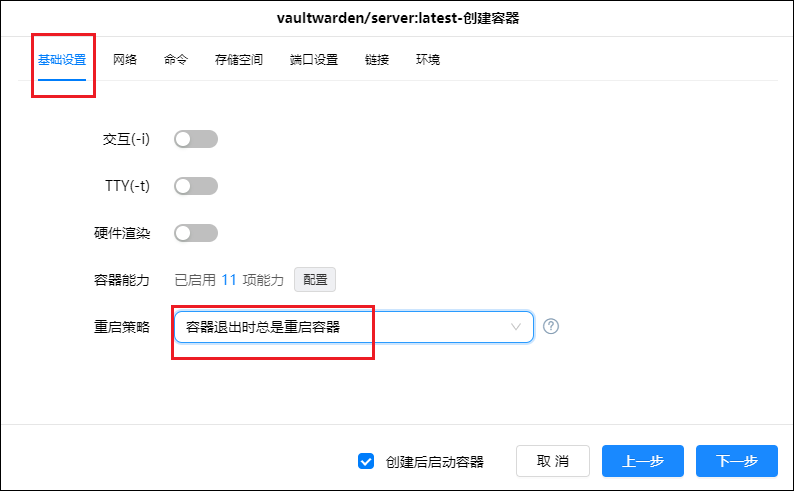

存储空间设置

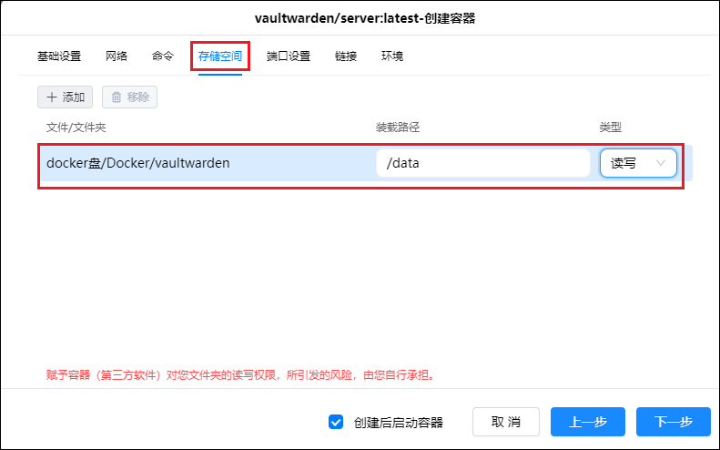

端口设置

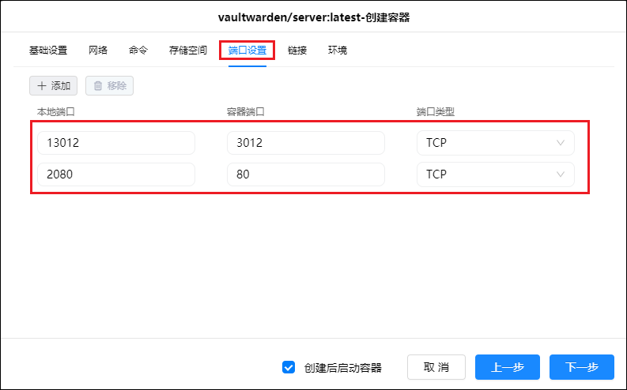

## 2、初始化

1、使用外网来登录（端口转发上面 80 对应的本地端口如 2080）进入网页，点击创建账户。

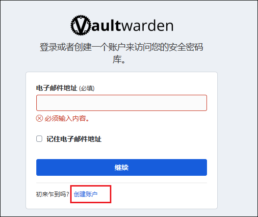

2、按要求填写后点击创建账户。

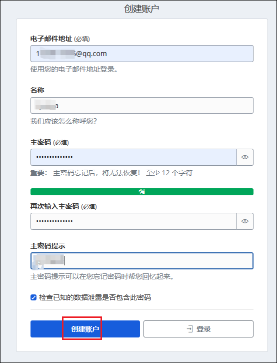

3、创建成功，点击继续

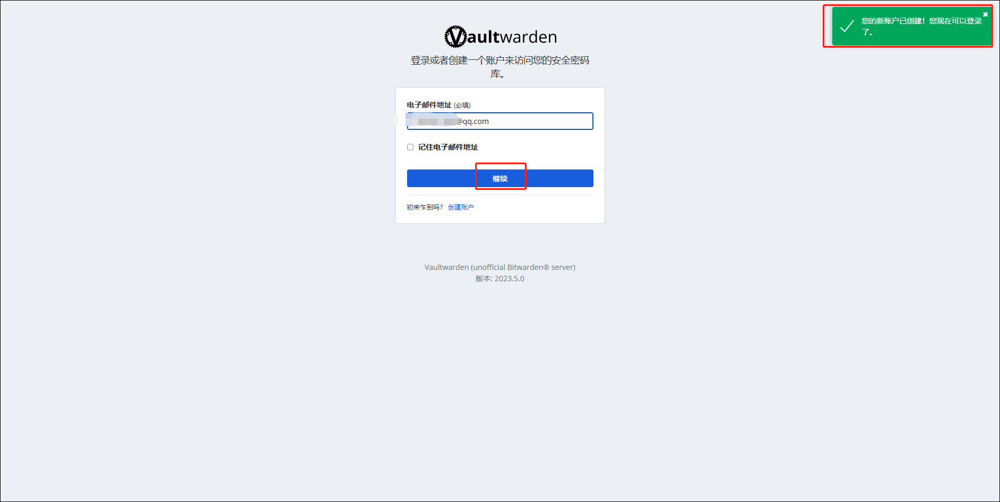

4、使用主密码登录

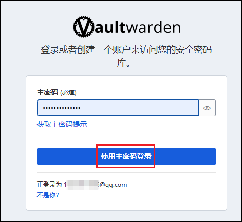

5、进入页面

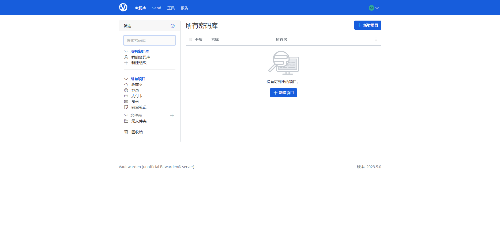

6、可以新建文件夹用来分类密码

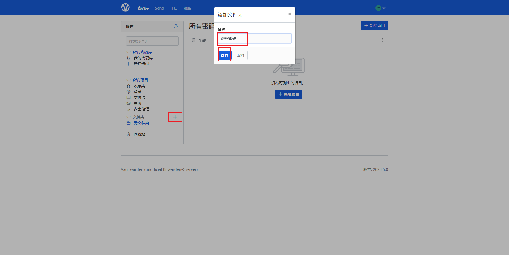

## 3、浏览器插件

1、在浏览器安装对应的插件

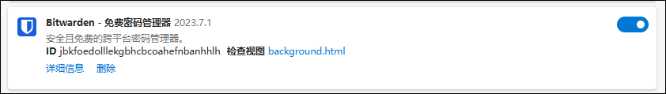

2、点击插件，输入邮箱后点击自托管。

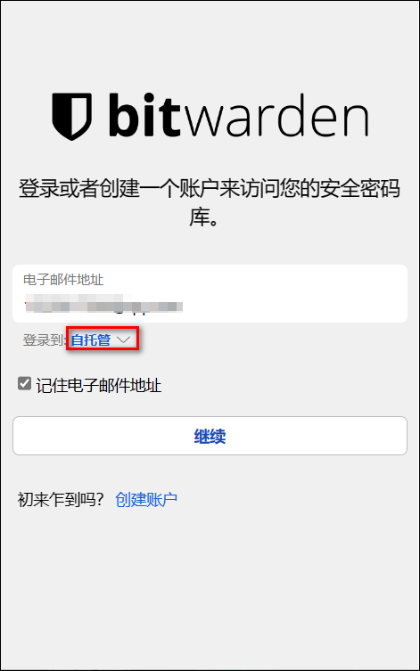

3、输入 docker 的公网地址后点击保存，回到登录页面点击继续。

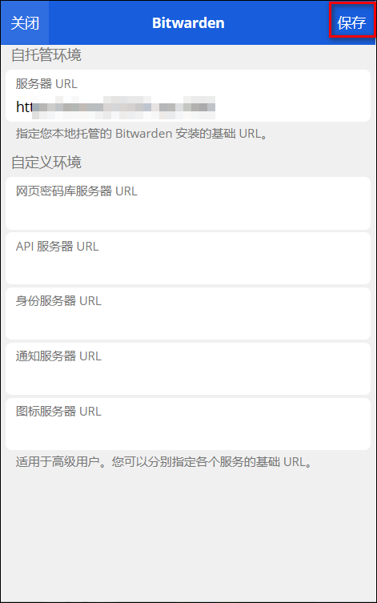

4、输入密码，点击登录。

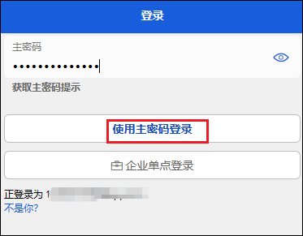

5、插件创建完成，可以点右上方的+添加密码项目。

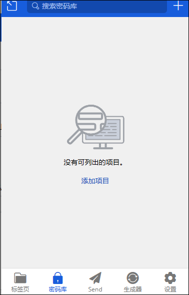
