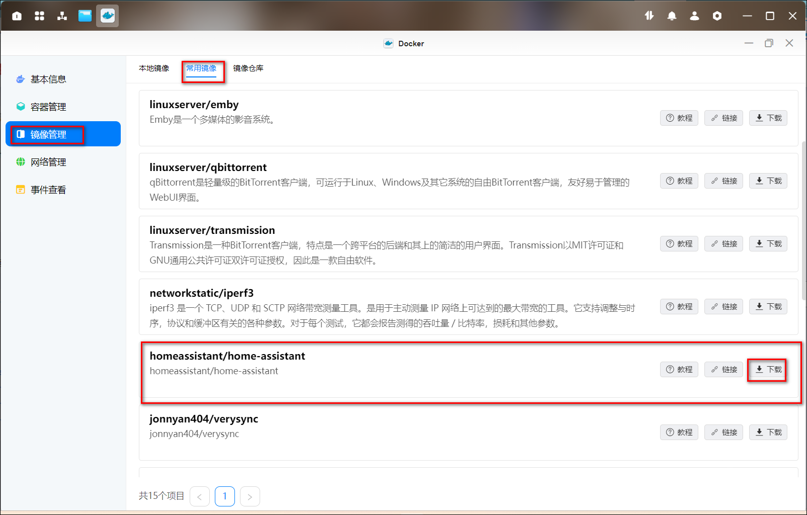
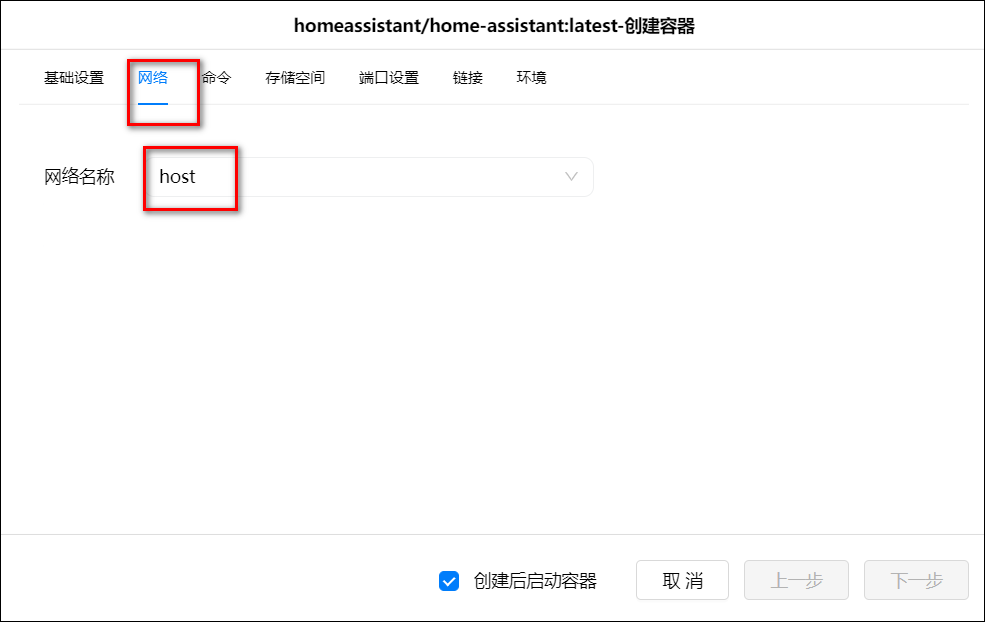
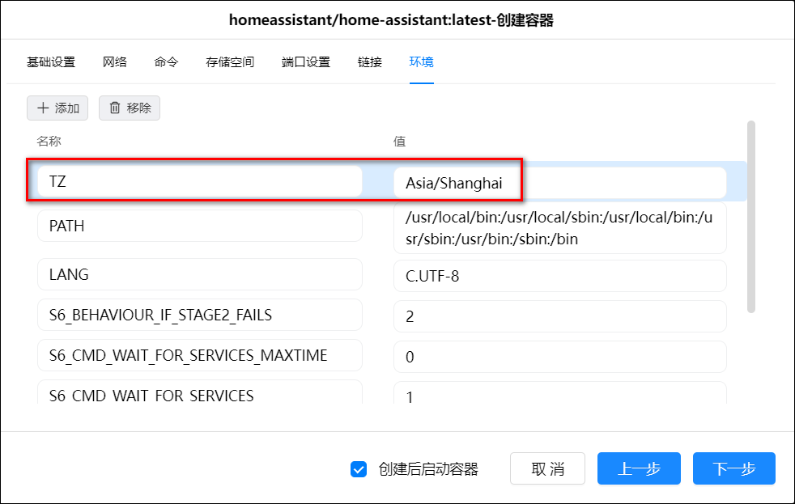
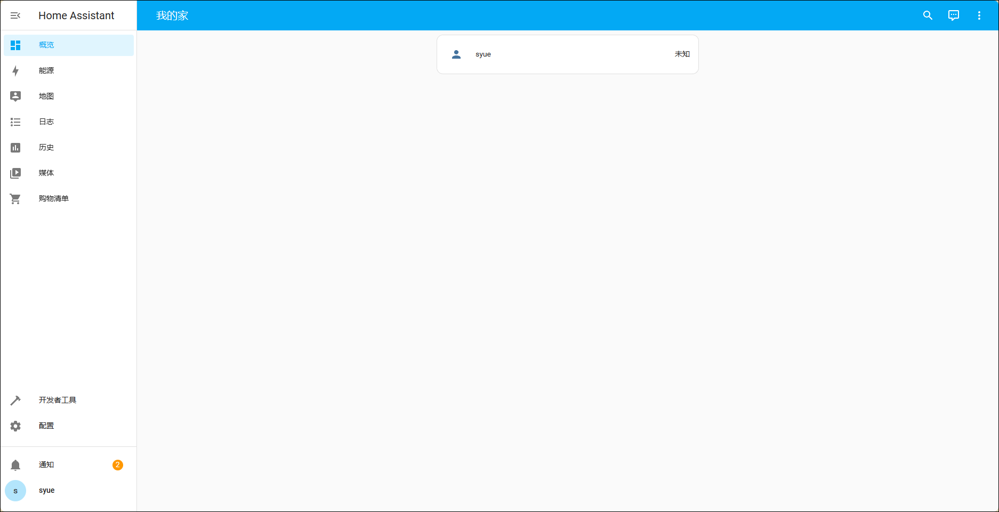
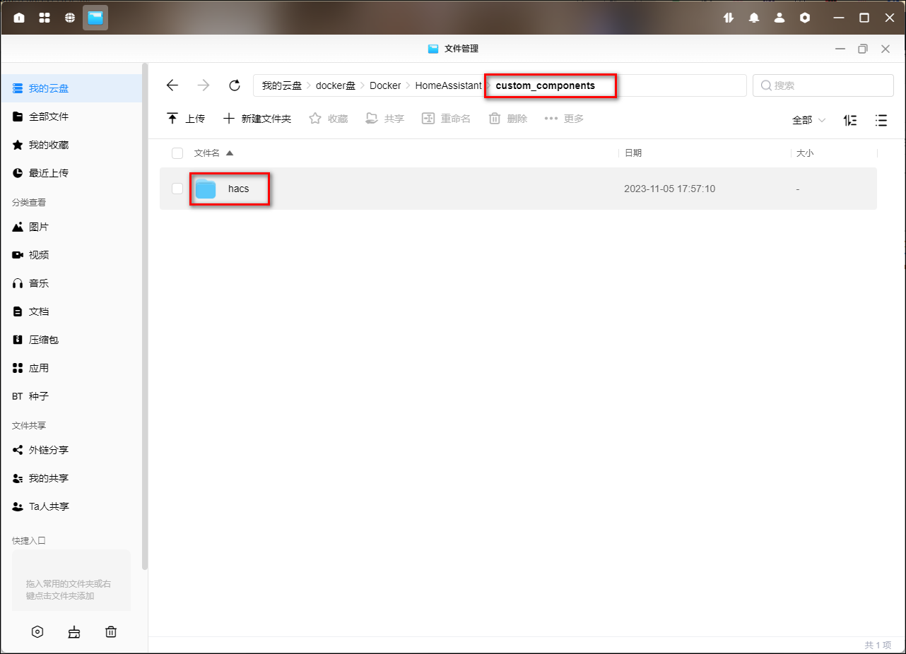
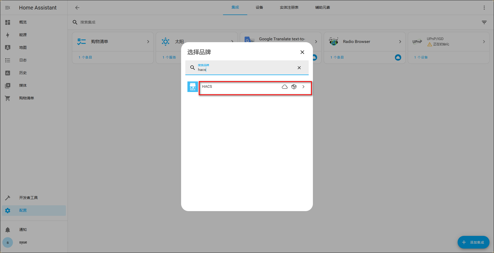
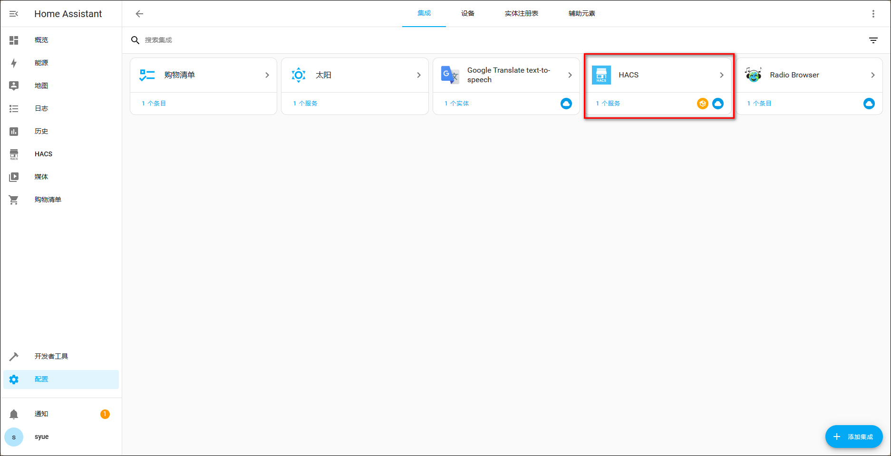
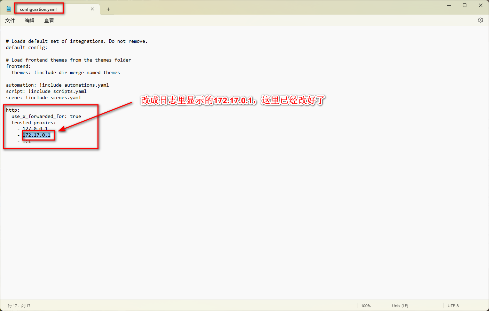

## 容器部署

### 1、镜像下载

在镜像管理-常用镜像里下载 homeassistant 镜像。

### 2、创建容器

1）网络：修改为 host。

2）先在 Docker 文件夹下新建一个 HomeAssistant 文件夹，然后选择 HomeAssistant 文件夹，设置装载路径为/config。

3）“环境变量”里添加一个“变量名”为 TZ，值为 Asia/Shanghai 的变量。

## 使用

### 1、初始化

1）打开 IP:8123 进入网页端，点击创建一个管理用户。

2）进入页面

### hacs

1、下载最新版 hacs：https://github.com/hacs/integration/releases

2、在 docekr-HomeAssistant 文件夹里新建个文件夹：custom_components，并把刚刚下载的 hacs 文件解压，然后上传进去。上传完后重启容器。

3、点击配置-集成-添加集成，选择 hacs

4、只有最后一项（实验性功能）是可选的，您需要接受上述所有内容，然后才能设置 HACS。

5、在第一个屏幕上，您会看到一个设备代码，将其复制到剪贴板，然后单击 <https://github.com/login/device> 链接以继续设置。

6、输入刚刚的设备代码来激活设备

7、点击授权 hacs

8、授权成功

9、创建配置成功，点击完成

10、可以在集成里看到 hacs

### 外网访问

点击配置-系统

选择网络

填写外网访问的网址

### 日志

1、如果外网访问显示以下错误

2、点击配置-系统

3、选择日志

4、查看日志内容

5、更改配置文件夹中 configuration.yaml 文件的内容

