## 1、容器部署

1、点击镜像管理-本地镜像-添加-官方库，镜像名称输入：kangkang223/baota，输入后等待一下，直到输入框下方显示出下拉列表，表示从 docker 源加载到数据，再点击确定，因为如果不等待下拉列表直接点确定，系统会报错并提示：请输入 url 地址。

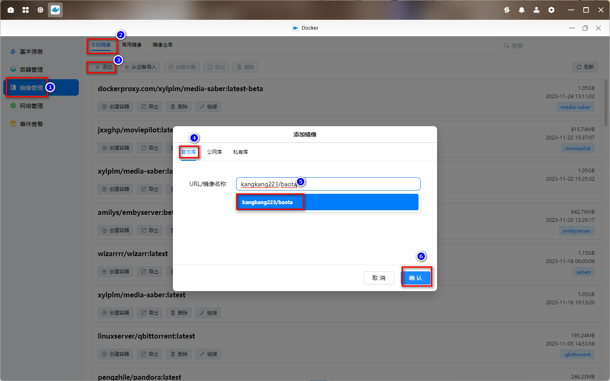

2、确定后弹出选择版本对话框，等待安装版本中的 latest 变成列表可选状态后点确定进行下载。

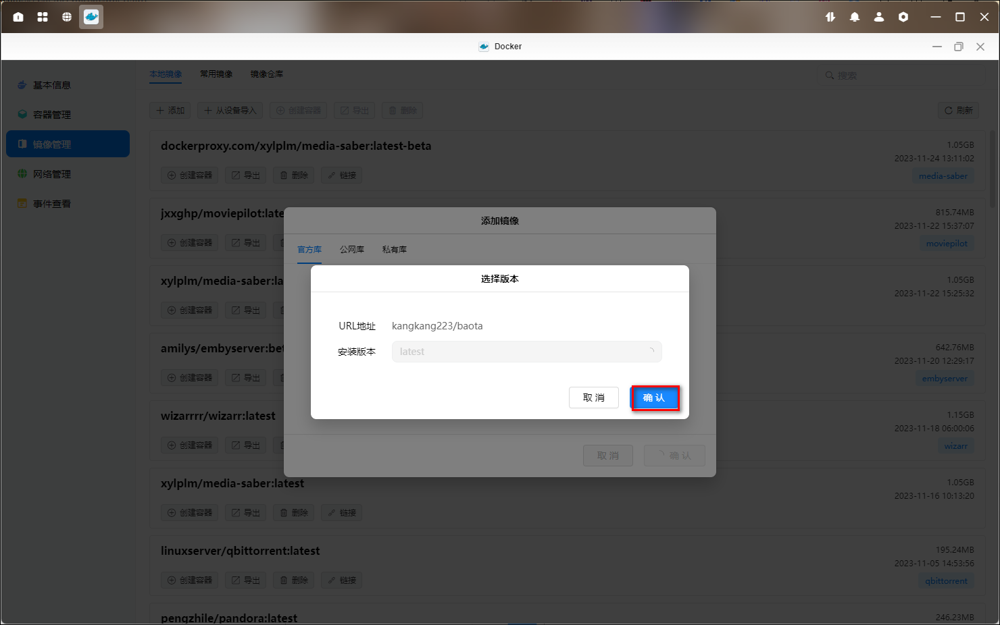

3、在本地镜像中找到刚刚下载完成的镜像，点击创建容器。可以启用一下资源限制，勾选创建后启动容器，点击下一步。

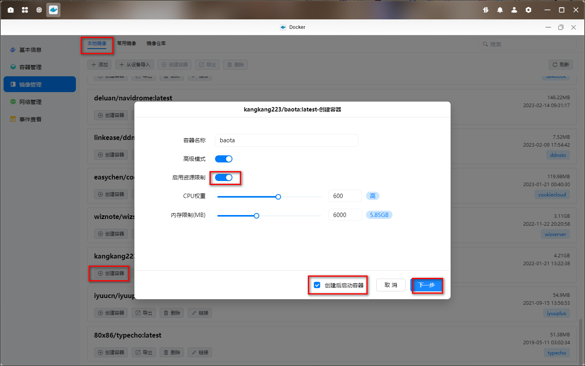

4、基础设置里指定重启策略

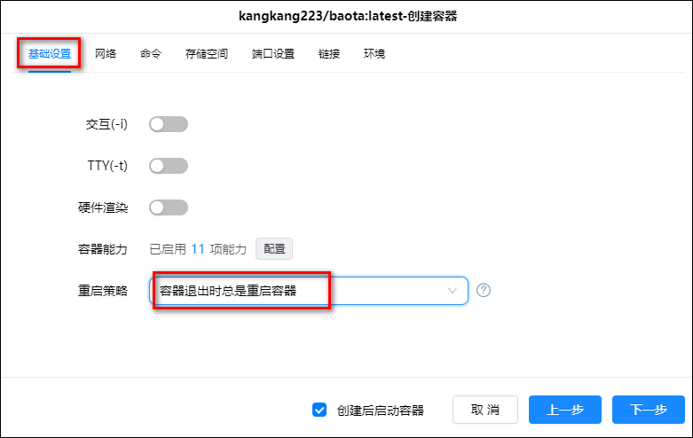

5、网络为 host 模式

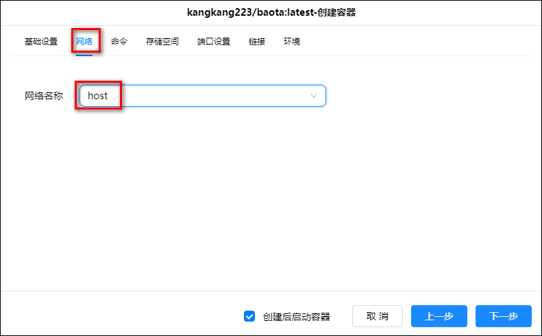

6、在 docker 文件夹里新建一个 baota 文件夹，并新建两个子文件夹：backup 和 wwwroot，把它俩分别挂载为/www/backup、/www/wwwroot，类型都为读写

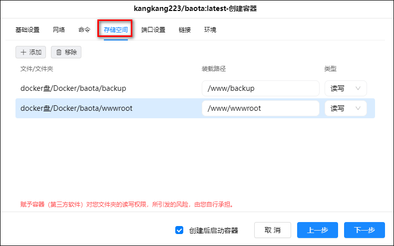

7、因为我们选择了 host，所以不用修改这里。如果选择了 bridge 模式，这里自行添加需要使用的所有端口。

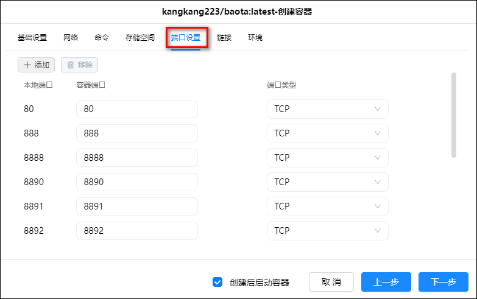

## 初始化

1、浏览器输入 IP：8888，会出现以下界面，别慌，这是正常的

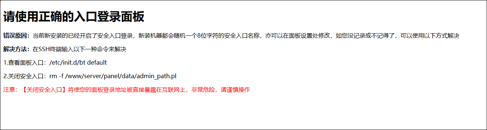

2、点击容器管理，找到安装好的宝塔容器，点击详情

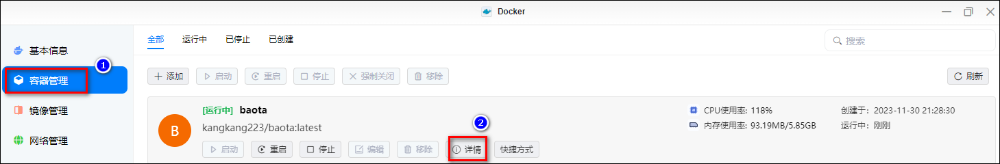

3、点击终端，点击连接，注意需要在局域网连接模式下

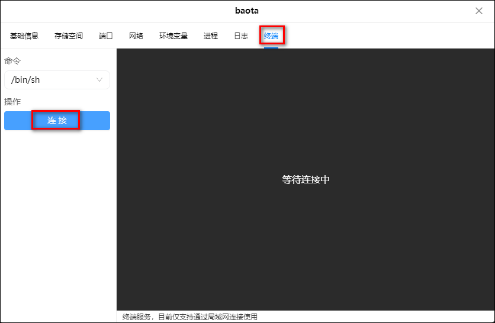

4、连接成功后是这个界面

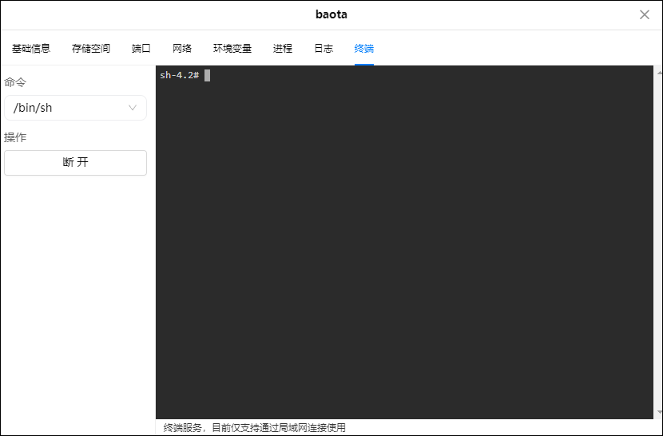

5、复制命令：/etc/init.d/bt default，然后 Ctrl+Shift+V 来粘贴命令，粘贴完成后回车后得到面板的登录地址和账号密码

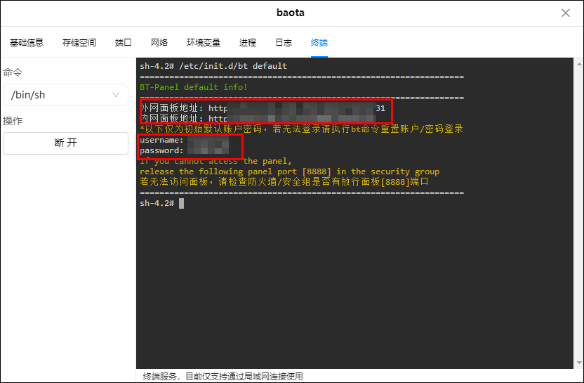

6、进入登陆地址，并按它显示的用户名 kangkang，密码 f78679a7，来登录，发现以上信息无法成功登录，因为它是系统初始值。

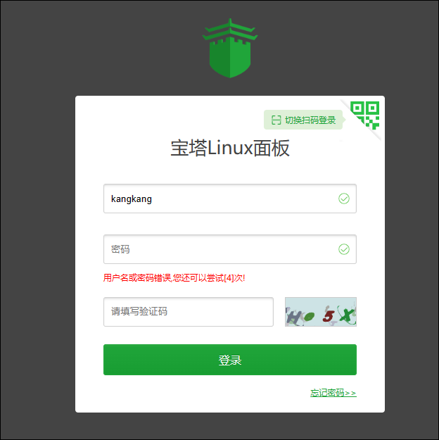

7、我们再次在终端中连接，并输入 cd /www/server/panel && btpython tools.py panel ugreen，其中 ugreen 就是我们设置的真实密码，你可以改成你自己的

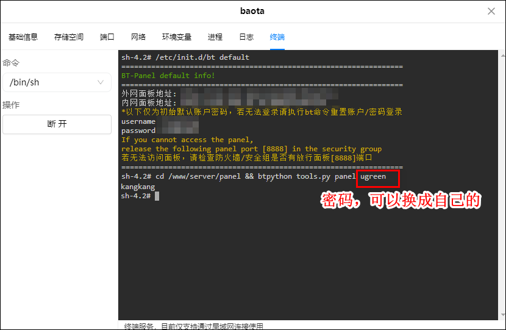

8、重新输入刚刚设置的密码，登陆成功。输入宝塔账号密码，绑定宝塔账号。

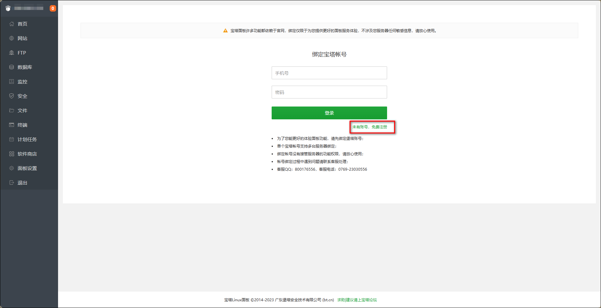

9、如果没有账号点击登录上方的免费注册去注册一个。

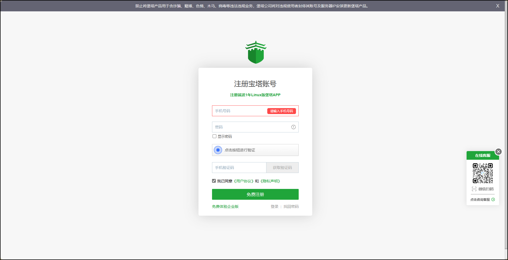

10、绑定宝塔账号后进入控制台，可以在面板设置里修改别名、默认端口、面板用户和密码。

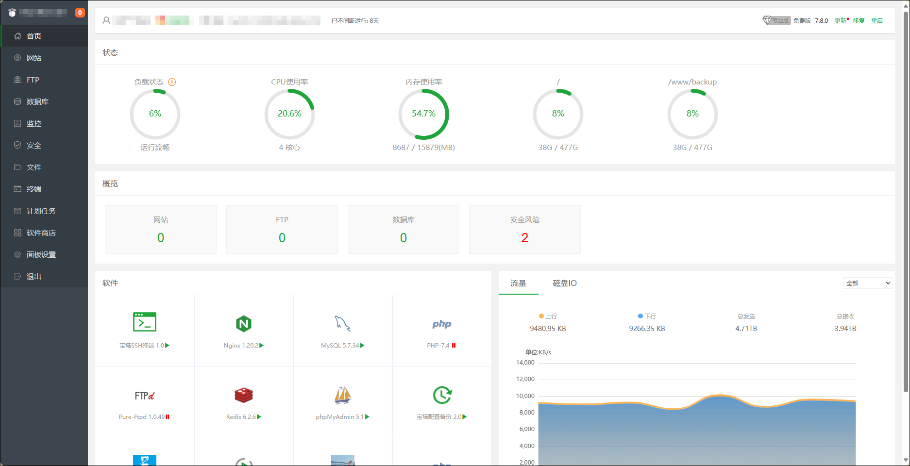
