## NAS 端

1、打开绿联 docker，点击镜像管理-镜像仓库，搜索 `jonnyan404/verysync`，点击下载最新版本的镜像。

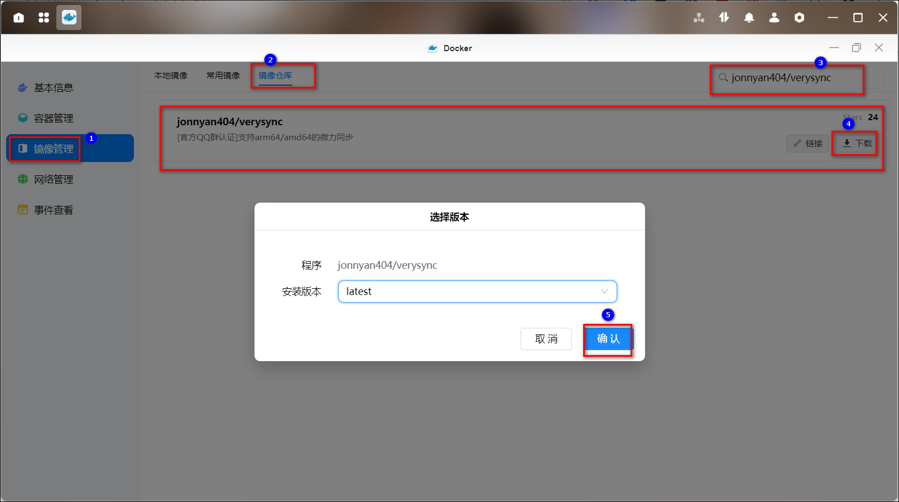

2、找到刚刚下载好的镜像，点击创建容器。名称可以自定义，勾选创建后启动容器。然后点击下一步。

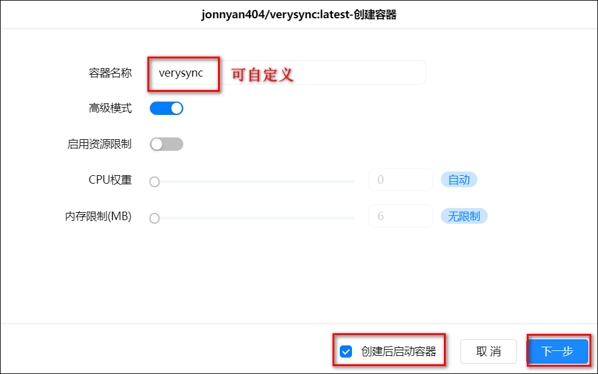

3、基础设置：改一下重启策略为容器退出时总是重启容器。

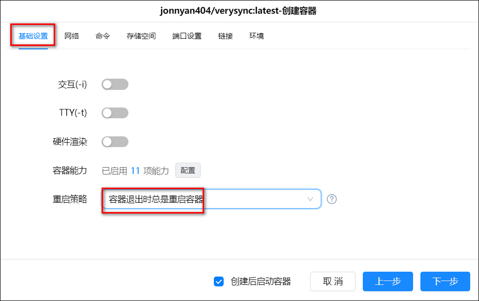

4、存储空间：把要用来做同步文件夹的文件夹路径挂载上，类型一定要选读写。

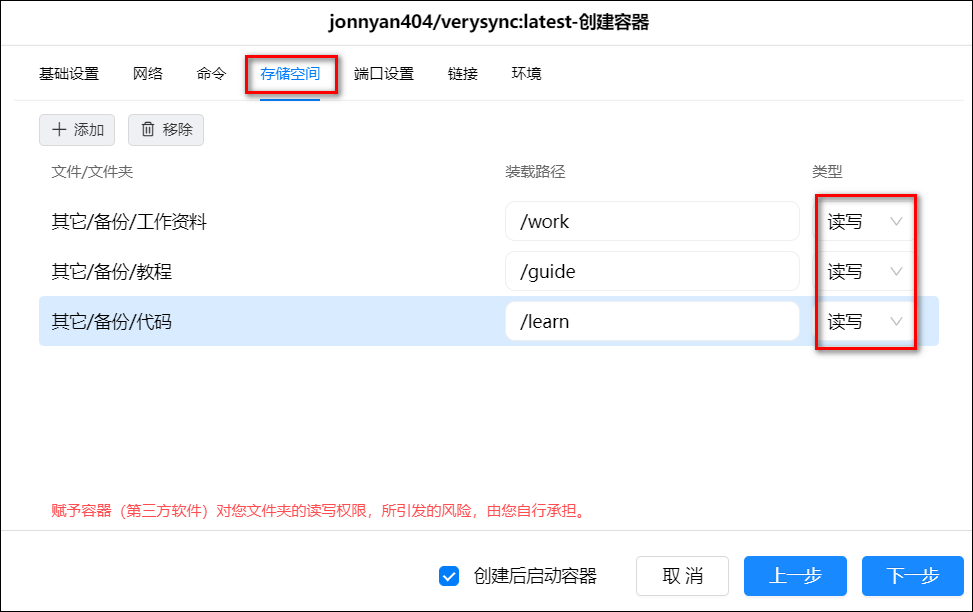

5、端口设置：容器端口是默认的 8886，本地端口随意一个你自己没有被占用过的就好。设置两个端口，TCP 和 UDP 各一个。然后点击下一步，再点击完成完成容器安装。

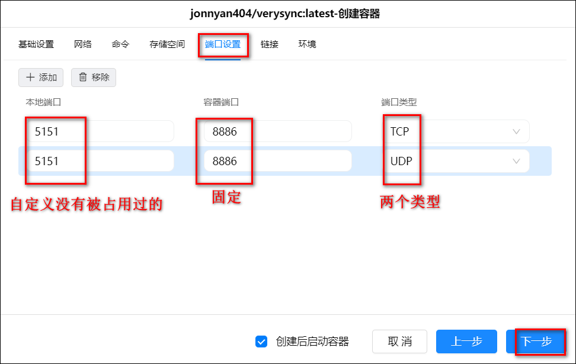

6、在浏览器输入你 nas 的 IP:5151(这个 5151 就是我刚刚设置的本地端口，你改成自己的即可)进入页面。勾选接受协议，然后取个名字后点击开始使用。

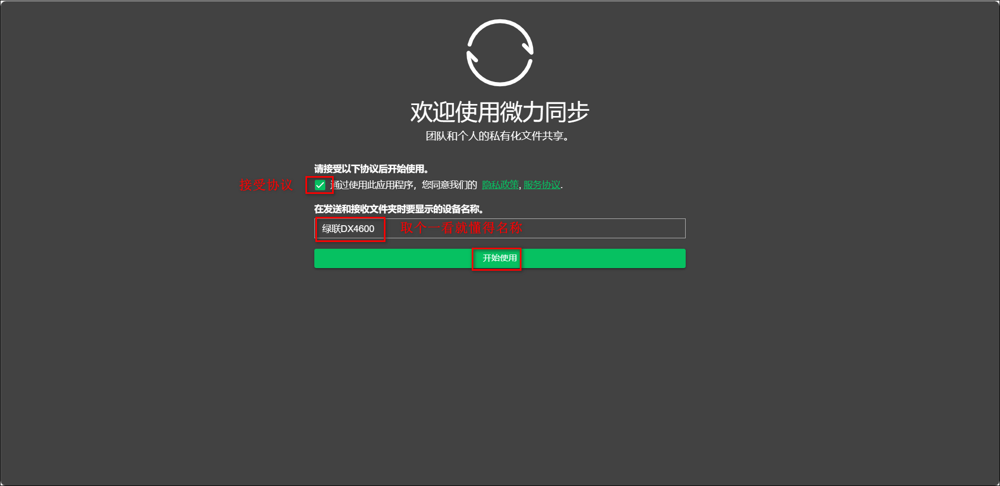

7、进入界面，点击左上角可以注册账号。

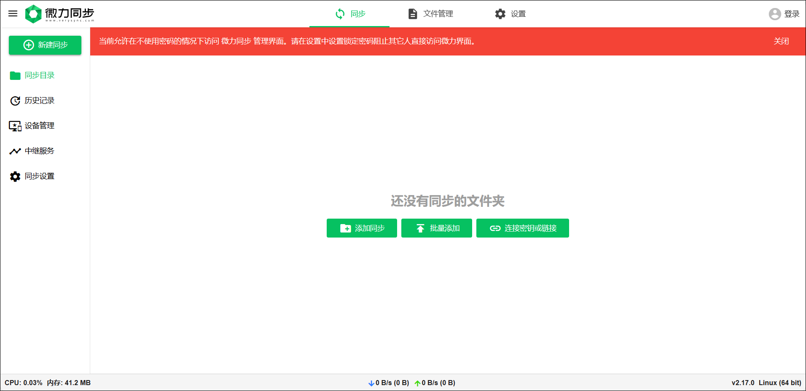

## 电脑端

微力同步官网：https://www.verysync.com/download.html

在官网下载你自己的版本的软件，比如我是 win 版的。

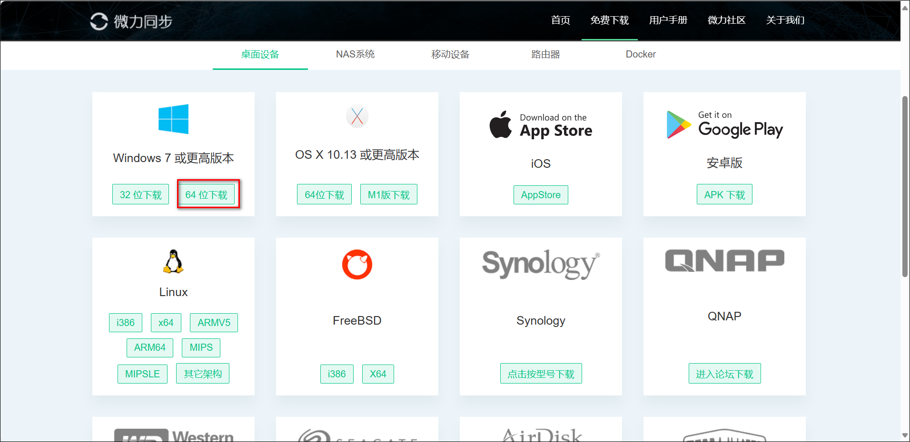

2、下载完成是个压缩包。解压后有个 exe 文件，点击打开，然后一样的接受协议和更改名称进入页面。

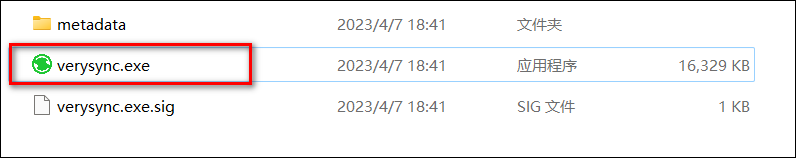

## 使用

微力同步教程：https://www.verysync.com/manual/users/start.html#add-folder

以电脑同步到 nas 为例：

1、创建同步目录：在电脑上打开微力同步的软件，点击“新建同步”按钮，在弹出的添加菜单中选择“标准文件夹”。然后选择要进行共享同步的文件夹。

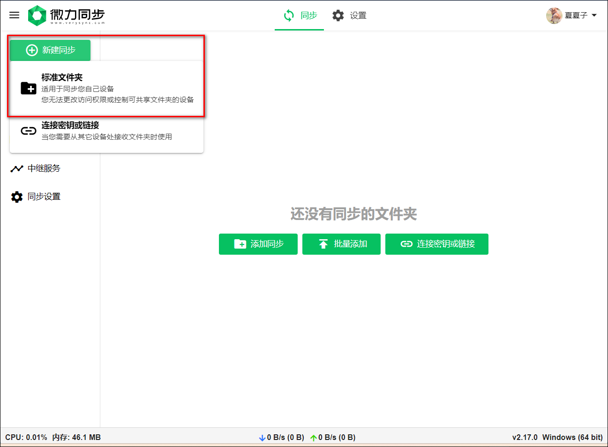

注意：创建目录时微力同步默认将选择的文件夹名作为此同步目录的名称，在创建成功后可通过选项设置修改目录名。

2、同步目录创建成功后会立即显示出用于连接的链接和密钥，权限可以选择只读或者读写。

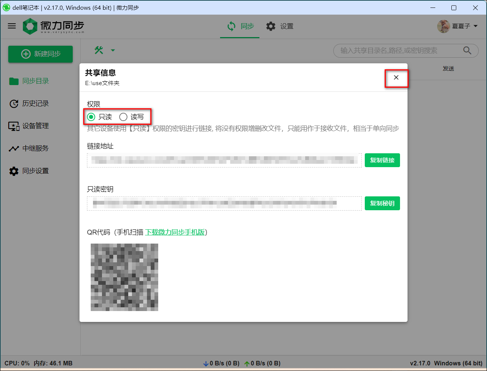

- 只读密钥：一般用于分享给朋友或同事，但又不希望对方能修改或删除我们的文件。如果其它设备通过该只读密钥进行连接，对目录进行文件添加或修改将不会同步到其它电脑上，且数据不会影响拥有读写权限密钥的设备。
- 读写密钥：一般用于自己多设备间资料的同步，希望将对目录的所有操作应用到所有电脑上。如果其它设备通过读写密钥进行连接，对目录进行文件添加/修改或删除操作，操作结果将同步到连接了该目录的所有设备上。

这里也可以先关掉，因为可以点击分享按钮也会出现。

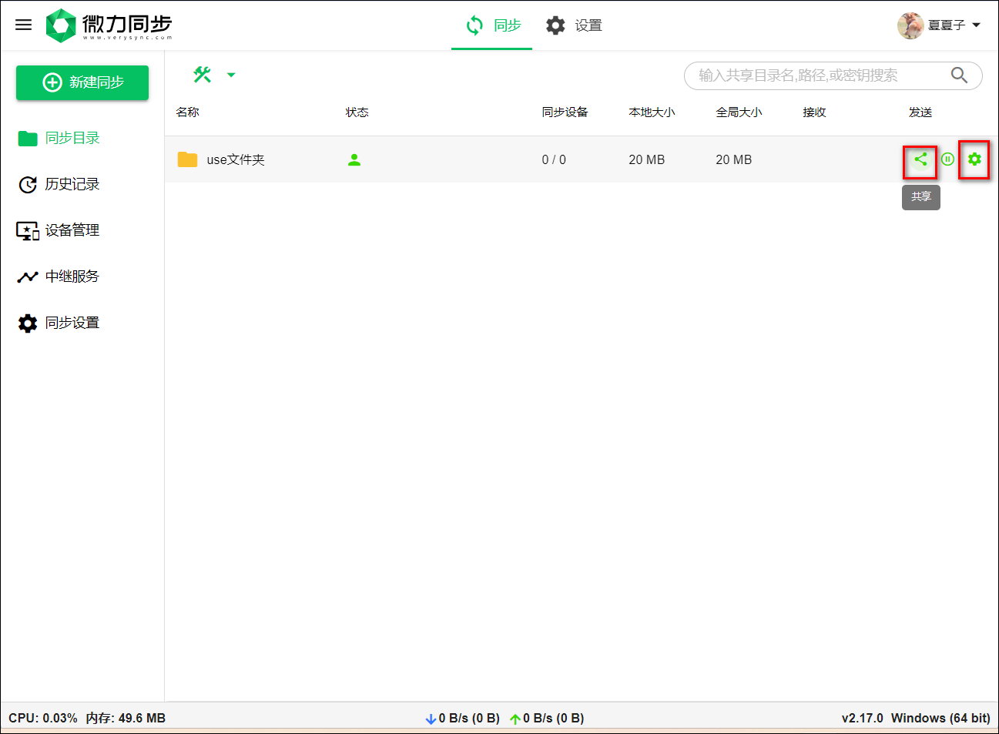

点击设置按钮，可以进行一些更改，比如更改扫描时间：

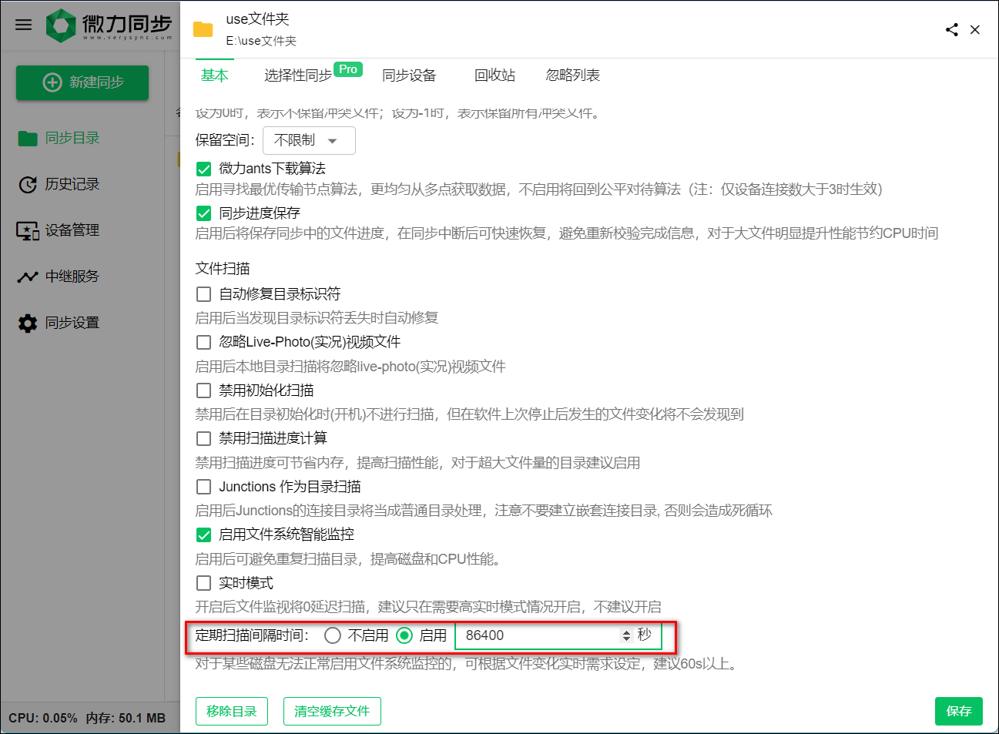

3、在 nas 端的微力同步中点击“新建同步”按钮，在弹出的添加菜单中选择“连接密钥或链接”。

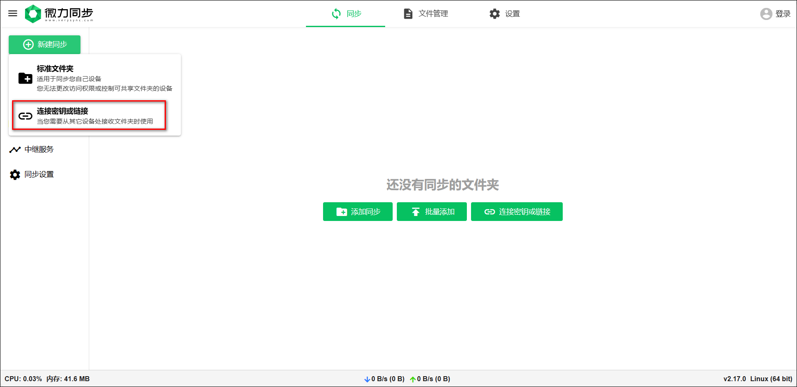

输入刚刚显示的链接/密钥，勾选添加后立即开始同步，点击下一步

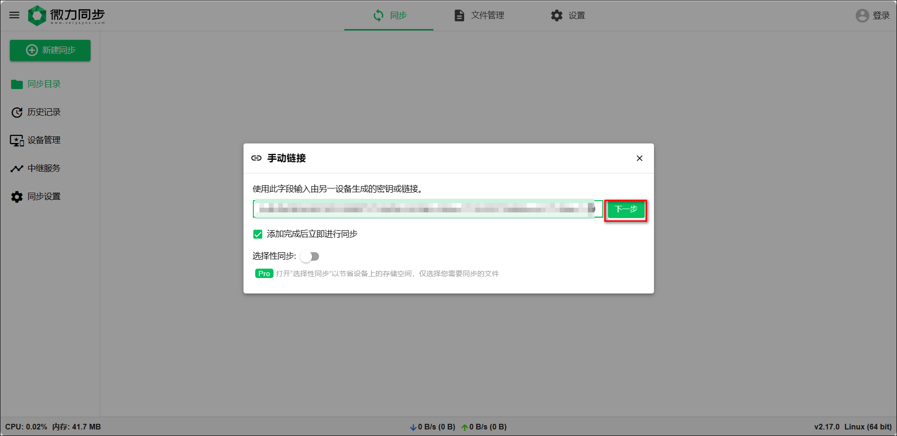

更改保存路径然后点击连接

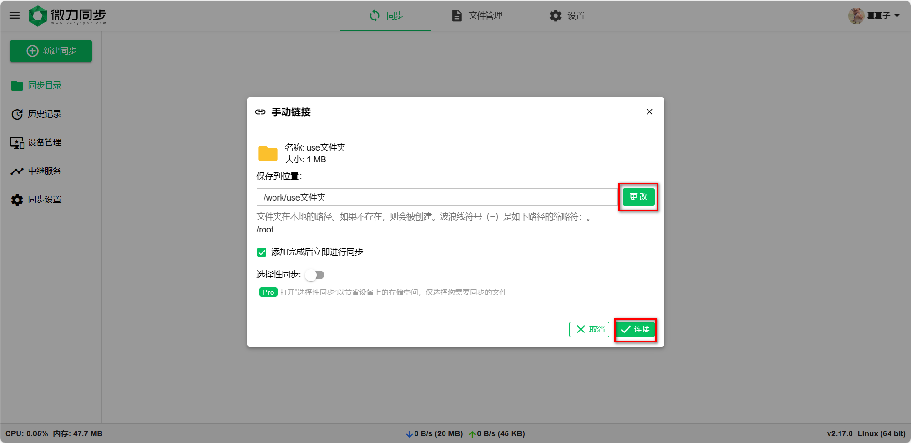

等一会可以看到同步完成的状态，也可以点击设备查看连接的设备。

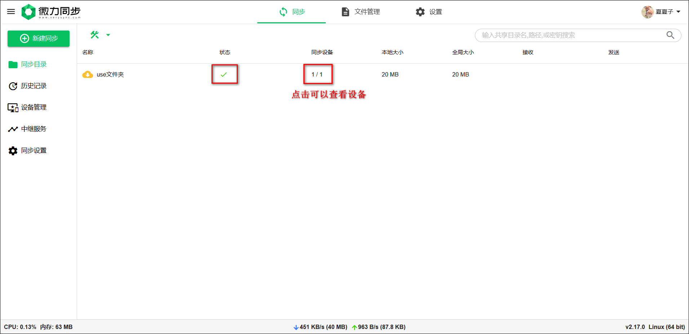
