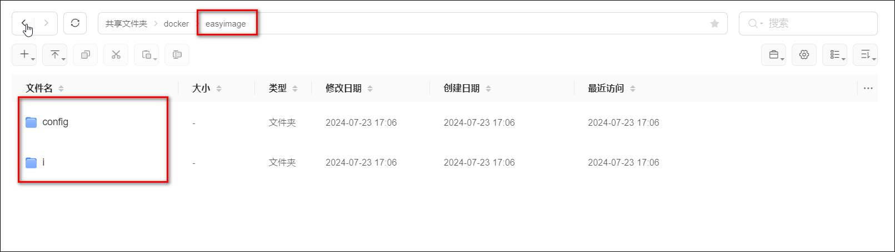
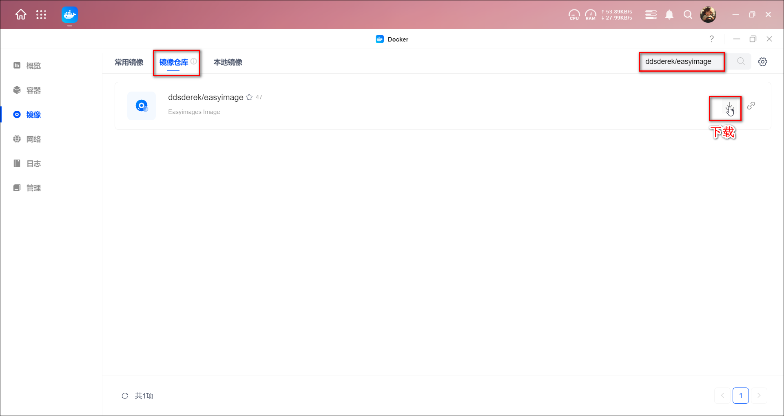
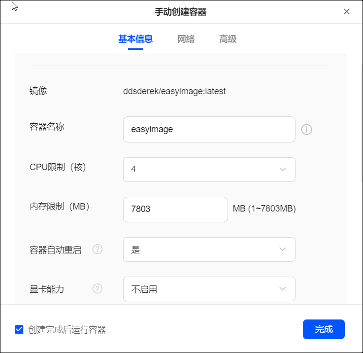
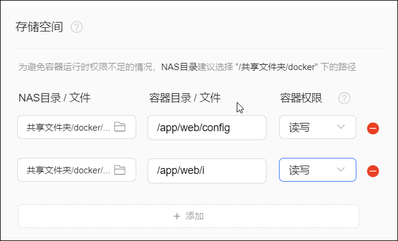
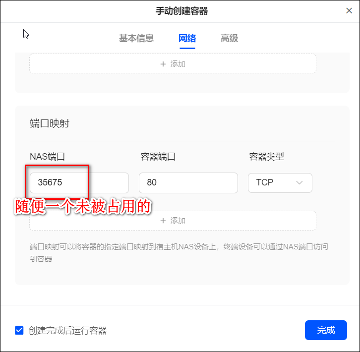
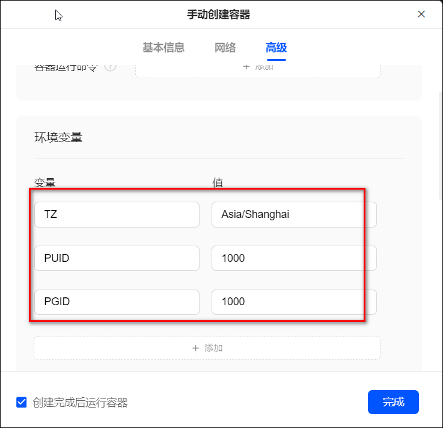
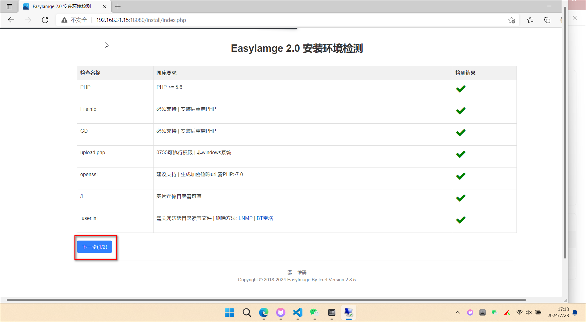
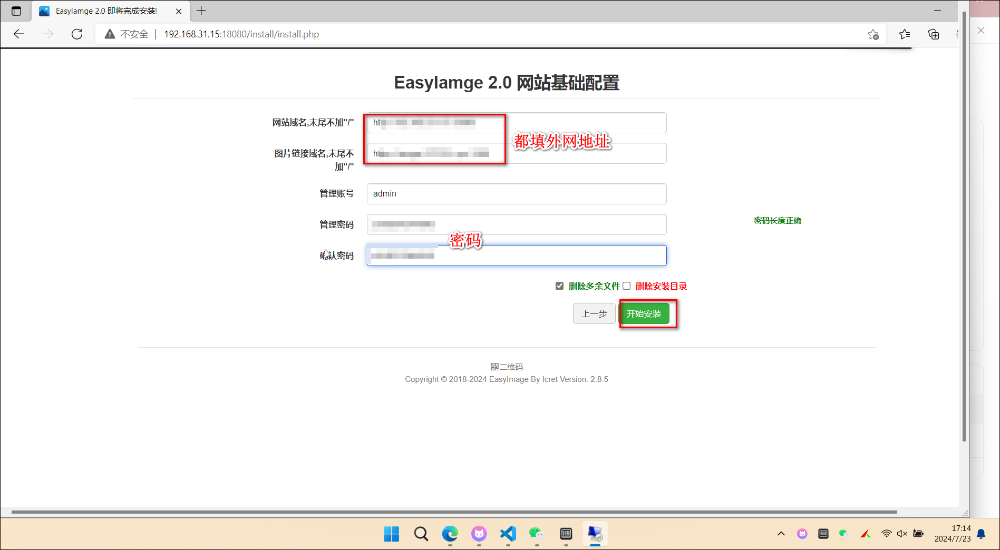
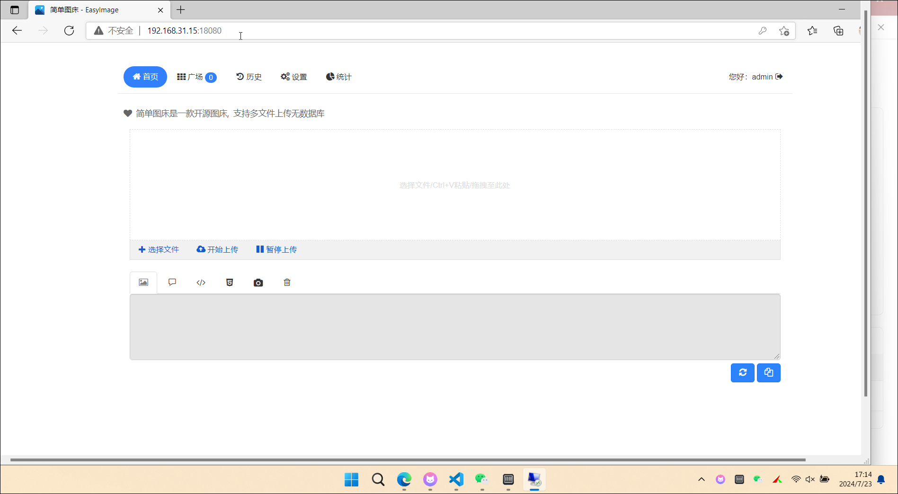

## 安装ddsderek/easyimage

### 绿联可视化安装

1、先在docker文件夹下建两个目录：config、i



2、搜索ddsderek/easyimage镜像，并下载最新版



3、创建容器

- 基本信息里容器名称和CPU、内存这些自定义，开启容器自动重启
  
    

- 存储空间挂载两个文件夹：config目录挂载为/app/web/config，i目录挂载为/app/web/i
  
    

- 网络这里NAS端口随便填个未被占用的

    

- 环境变量填下下面三个变量

    

至此安装完成

### docker-compose.yml 安装：

也可以 compose安装：


```
version: '3.3'
services:
  easyimage:
    image: ddsderek/easyimage:latest
    container_name: easyimage
    ports:
      - '8080:80'
    environment:
      - TZ=Asia/Shanghai
      - PUID=1000
      - PGID=1000
    volumes:
      - '/root/data/docker_data/easyimage/config:/app/web/config'
      - '/root/data/docker_data/easyimage/i:/app/web/i'
    restart: unless-stopped
```
## 使用

1、登录IP:NAS端口，点击下一步




2、域名可以填写内网网址/外网域名，这里我填写的是外网域名，记得统一，然后设置密码，点击开始安装



3、登录后来到页面

