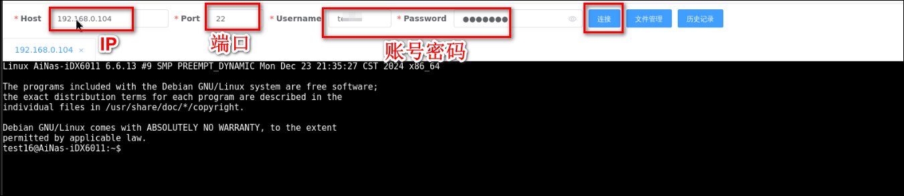

## docker-run 安装命令

```
docker run -d --net=host --log-driver json-file --log-opt max-file=1 --log-opt max-size=100m --restart always --name webssh -e TZ=Asia/Shanghai -e savePass=true jrohy/webssh

```

## compose 安装

```
services:
    webssh:
        container_name: webssh
        image: jrohy/webssh
        restart: always
        network_mode: host
        environment:
            - TZ=Asia/Shanghai
            - savePass=true #是否保存密码，不想保存就改成false
            - authInfo=xiaxiazi:test123 #登录web的用户名和密码
            - port=5032 #访问web应用的端口号，取个未被占用的
        logging:
            driver: json-file
            options:
                max-file: 1
                max-size: 100m
        command: /start.sh
```

## 使用

通过nas的ip:port参数配置的端口号打开web端，填入环境变量里【authInfo】的设置的用户名密码进行登录。然后就来到了主页，输入ip，端口号，用户名，密码即可进行远程ssh登录。

