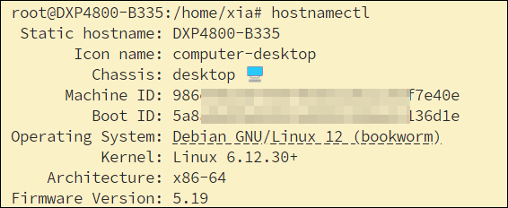
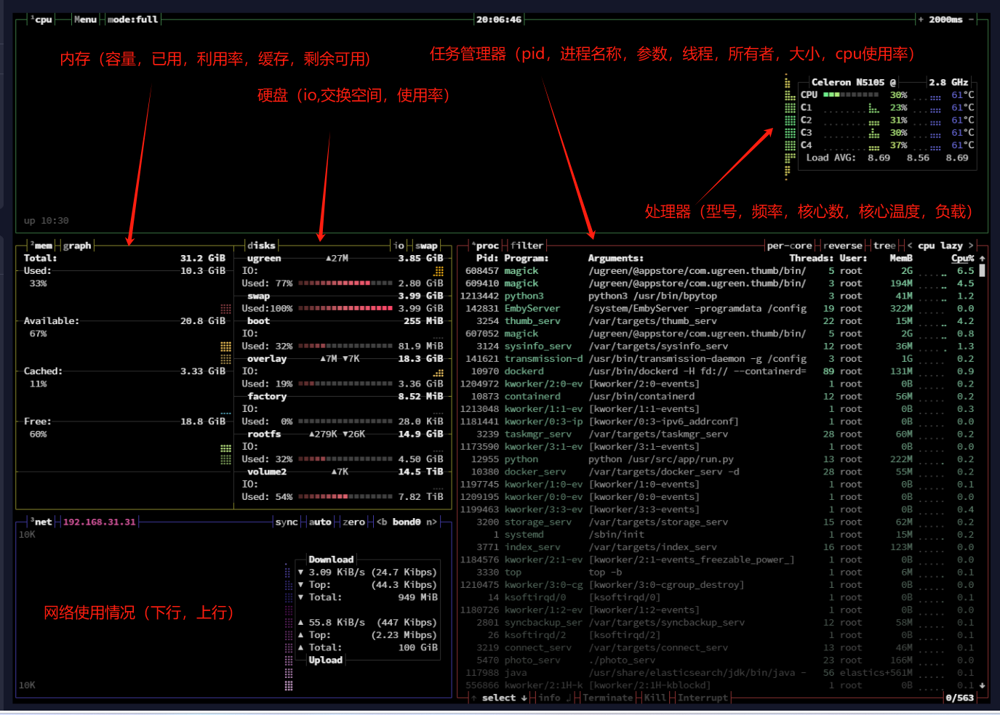

## 常用命令

### 切换root

sudo su : 用于切换到超级用户（root）权限

### 退出 ssh

输入 exit 然后按回车

### 查看主机信息 hostnamectl

`hostnamectl`  是一个 Linux 命令，通常用于管理系统的主机名和相关的系统信息。



修改主机名：通过  `hostnamectl set-hostname xxx`  命令，您可以更改系统的主机名为 XXX。

## 目录及文件

### pwd--显示用户当前所处的工作目录

用法：pwd [选项]...
选项：-P 显示链接的真实路径。

### cd--命令用于切换当前工作路径

用法：

- cd .. 切换路径至当前目录的上一级
- cd - 返回前一个路径
- cd 切换目录至当前用户的家目录

### ls--显示目录与文件信息

用法：ls [选项]... [文件/目录]
选项：
-a 显示所有，包括隐藏文件与目录。
-d 显示目录本身的信息，而非目录内的文件。
-h 人性化显示容量信息。
-l 长格式列出文档详细信息。包括权限设置和文件属性。
-i 显示每个文件的 inode 号。
-S 根据文件大小排序
-u 显示文件或目录最后被访问的时间。

示例：

```
ls -l /volume3/docker/cow/godcmd.py

```

输出结果可能类似于以下格式：`-rwxrwxrw-+ 1 syue admin 378 May 23 10:34 /volume3/docker/cow/godcmd.py`

- `-rwxrwxrw-+`: 表示文件权限，其中第一个字符 - 表示这是一个常规文件，后续的权限位分为三组，每组三个字符，分别代表文件所有者、文件所属组和其他用户的权限。其中：
  - rwx：文件所有者 (syue) 具有读、写和执行权限。
  - rwx：文件所属组 (admin) 具有读、写和执行权限。
  - rw-：其他用户也具有读和写权限
- `1`: 表示链接数，通常是指向该文件的硬链接数。
- `syue`: 文件所有者是用户 syue。
- `admin`: 文件所属组是 admin。
- `378`: 表示文件大小（以字节为单位）。
- `May 23 10:34`: 表示文件的最后修改日期和时间。
- `/volume3/docker/cow/godcmd.py`: 是文件的完整路径。

通过这个命令的输出，您可以查看文件 openai_voice.py 的权限设置，所有者、所属组、大小以及最后修改时间等信息。

### mkdir--创建目录

用法：mkdir [选项]...[目录]...
选项：-p 创建多级目录。

### cp--复制文件与目录

用法：cp [选项] 源 目标
选项：
-r 递归复制目录及其子目录内的所有目录。
-a 复制时保留源文档的所有属性（包括权限、时间等）。

### rm--删除文件或目录

删除文件时可以不加选项，删除目录时必须加选项 -r

用法：rm [选项]...文件...
选项：
-f 不提示，强制删除。
-r 递归删除，删除目录及目录下的所有内容。

### find--搜索文件或目录

用法：find [命令选项] [路径] [表达式选项]
选项：
-name 按文档名称查找
-iname 按文档名查找，且不区分大小写
-mtime 按修改时间查找
-group 按组查找
-user 按用户查找
-size 按容量大小查找
-type 按文档类型查找，文件（f）、目录（d）、设备（b，c），链接（l）等。
-exec 对找到的文档执行特定的命令
-a 并且
-o 或者

### du--计算文件或者目录的容量

用法：du [选项]...[文件或目录]...
选项：
-h 人性化显示容量信息
-s 仅显示总容量


示例：`du ./ -h --max-depth=1`

- du显示文件或目录磁盘占用的命令 
- ./当前目录 
- -h 已易读的方式显示
- --max-depth=1显示参数（文件或目录的占用限制输出到目录的一级子目录）


### 改变文件或目录的权限chmod

#### 符号模式

在符号模式下，可以使用 chmod 命令按以下格式添加权限：

`chmod [类别][操作][权限] 文件名`

- 类别：u（用户User）、g（组Group）、o（其他Others）、a（所有All）
- 操作：+（添加）、-（移除）、=（设置）
- 权限：r（读Read）、w（写Write）、x（执行Execute）

**示例**

给所有用户添加读权限：`chmod a+r filename`


#### 八进制模式

在八进制模式下，可以使用 chmod 命令按以下格式添加权限：

`chmod [权限] 文件名`

权限：由三个数字组成，每个数字代表不同用户类别的权限（用户、组、其他）。

**权限的八进制表示法**

八进制表示法中的每个数字表示一个用户类别的权限，具体如下：

- 4：读（read）
- 2：写（write）
- 1：执行（execute）

这些值可以相加，以表示组合权限：

- 7（4 + 2 + 1）：读、写和执行
- 6（4 + 2）：读和写
- 5（4 + 1）：读和执行
- 3（2 + 1）：写和执行

**示例**

`chmod 755 filename`：文件所有者有读、写和执行权限（7），所属组和其他用户有读和执行权限（5）


## 查看文件内容

### cat--查看文件里的内容

用法：cat [选项]...[文件]...
选项：
-n 显示行号，包括空白行
-b 显示行号，空白行不显示行号

### more--查看文件里的内容

more 命令和 cat 的功能一样都是查看文件里的内容，但有所不同的是 more 可以按页来查看文件的内容，还支持直接跳转行等功能。

```
Enter键：向下n行，需要定义。默认为1行

空格键：向下滚动一屏

Ctrl+B：返回上一屏

= 输出当前行的行号

V 调用vi编辑器

!命令 调用Shell，并执行命令

q 退出more
```

### less--分页查看文件内容

操作：
空格（下一页）
方向键（上下回翻）
q 键（退出查看）

### head--显示文件头部内容

用法：head [选项]...[文件]...
选项：
-c nK 显示文件前 nKB 的内容。
-n 显示文件前 n 行的内容。

### tail--显示文件尾部内容

用法：tail [选项]...[文件]...
选项：
-c nK 显示文件末尾 nKB 的内容。
-n 显示文件末尾 n 行的内容。
-f 动态显示文件内容，常用于查看日志，按 Ctrl+C 组合键退出。

### grep--查找

用法：grep [选项] 匹配模式 [文件]...
常用选项：
-i 忽略大小写。
-v 取反匹配

示例：
[root@qll ~]# grep root /etc/passwd #在 passwd 文件中过滤出包含 root 的行。


### 查看文件md5

用法：`md5sum <filename>`

这里的 filename 是你想要计算 MD5 校验和的文件的名称。例如：

`md5sum example.txt`

处理文件名中的特殊字符：如果文件名包含空格或特殊字符，你可能需要将文件名用单引号或双引号括起来。例如：

`md5sum '散就散了 - 庆庆.mp3'`


## apt 相关

apt 命令执行需要超级管理员权限(root)。

- 列出所有可更新的软件清单命令：`apt update`
- 升级软件包：`apt upgrade`
- 列出可更新的软件包及版本信息：`apt list --upgradeable`
- 升级软件包，升级前先删除需要更新软件包：`apt full-upgrade`
- 安装指定的软件命令：`apt install <package_name>`
- 安装多个软件包：`apt install <package_1> <package_2> <package_3>`
- 更新指定的软件命令：`apt update <package_name>`
- 显示软件包具体信息,例如：版本号，安装大小，依赖关系等等：`apt show <package_name>`
- 删除软件包命令：`apt remove <package_name>`
- 清理不再使用的依赖和库文件: `apt autoremove`
- 移除软件包及配置文件: `apt purge <package_name>`
- 查找软件包命令： `apt search <keyword>`
- 列出所有已安装的包：`apt list --installed`
- 列出所有已安装的包的版本信息：`apt list --all-versions`

## bpytop--终端资源监视器

- 安装：`sudo apt install bpytop`

- 使用：在终端中输入  `bpytop`  回车，即可打开 bpytop 工具

- 退出：按键盘上的  `q`  键，将关闭 bpytop 工具并返回到终端提示符

- 效果：

  
