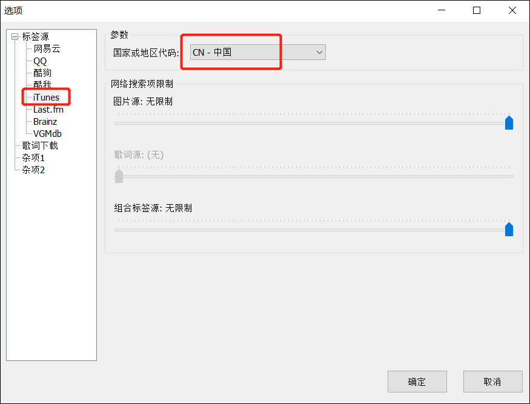
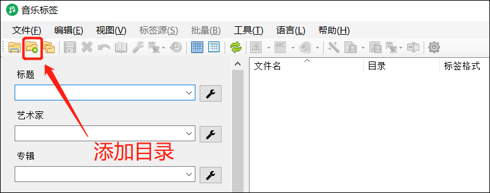
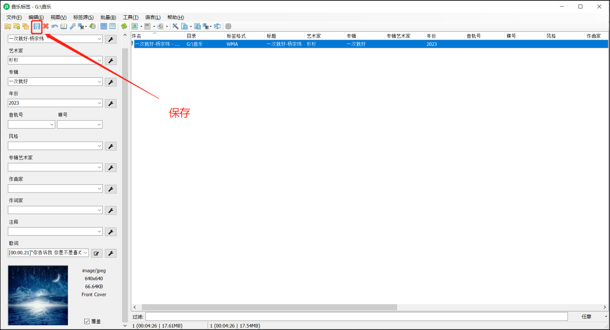

## 说明

MusicTag其实是一款国内大佬@vinlxc个人制作的一款音乐标签嵌入神器。 音乐标签其实指的就是歌曲的标题，专辑，艺术家，歌词，封面等信息，通过MusicTag，我们可以批量的一键修改和添加指定歌曲的标签。

它支持的歌曲格式有LAC, APE, WAV, AIFF, WV, TTA, MP3, MP4, M4A, OGG, MPC, OPUS, WMA, DSF, DFF等，并且标签源包括了网易云、QQ歌曲、虾米、酷我、酷狗、iTunes、Last. fm、VGMdb、brainz等国内外主流歌曲平台，尤其是对中文歌曲的支持更好。

MusicTag分为电脑版和安卓版，它没有官网，作者将它发布在了自己的[博客](https://www.cnblogs.com/vinlxc/p/11347744.html)，可以根据自己的需求下载对应的版本。

## 使用

1、双击应用程序

进入界面：

设置选项：

勾选标签源：

选择iTunes的地区：

歌词下载设置，设置完后点击确定：

添加音乐文件夹目录：

导入音乐文件：

点击自动匹配标签：

修改好后按确定：

修改完成：

选择组合标签源：

选择自己喜欢的标签源：

修改完成：

保存标签：

点击文件名相关：

设置文件名批量处理规则，修改后按确定：

点击保存：

