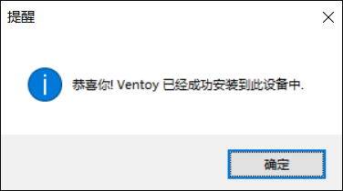

官网链接：https://www.ventoy.net/cn/download.html

1、下载后得到一个软件压缩包，将下载下来的压缩包进行解压后双击Ventoy2Disk.exe运行程序（此程序无需安装，双击即可运行）进入主界面。

4、点击配置选项会出来以下几个子菜单，然后我们把分区类型修改成GPT。

讲解一下【配置选项】：
- 安全启动支持：即Secure Boot
- 分区类型：MBR、GPT；
- 分区设置：是否要在磁盘最后设置保留空间。
- 清除Ventoy
- 显示所有设备：显示电脑本身的硬盘及插在电脑上的移动存储介质（U盘、移动硬盘等）；不建议显示所有设备，以免误操作。

5、设置完成后，点击下方的【安装】，此时会跳出个警告框，点击是。

6、等一会，跳出提醒框，显示成功安装。

7、点击确定后回到主页面，此时设备内部的版本号已显示。此时表示安装完成，我们就能使用u盘启动电脑了。

主界面的一些显示说明：
- 安装包内 Ventoy 版本：当前安装包中的Ventoy版本号；
- 设备内部 Ventoy 版本：U盘中已安装的Ventoy版本号，如果为空则表示U盘内没有安装Ventoy；
- 左侧显示的 MBR/GPT：用户当前选择的分区格式，可以在选项中修改，只对安装过程有效；
- 右侧显示的 MBR/GPT：设备当前使用的分区格式 （也就是当初安装Ventoy时选择的分区格式），如果U盘内没有安装Ventoy，则会显示空；
- 安装：把Ventoy安装到U盘，只有第一次的时候需要，其他情况就只需要Update升级即可；
- 升级：升级U盘中的Ventoy版本，升级不会影响已有的ISO文件；

Ps：安装完之后，U盘存放镜像文件的第1个分区会被格式化为 exfat 系统，你也可以手动把它重新格式化为 FAT32/NTFS/UDF/XFS/Ext2/3/4 系统。对于普通U盘建议使用exFAT文件系统，对于大容量的移动硬盘、本地硬盘、SSD等建议使用NTFS文件系统。
