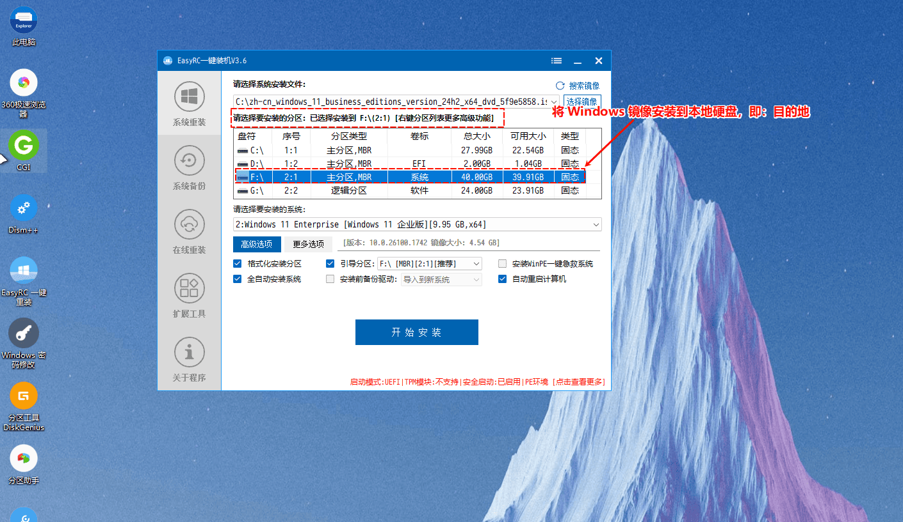

在U盘中安装 WinPE 系统后，可以通过 U 盘启动电脑，进入 WinPE 环境进行操作：系统修复、数据恢复以及磁盘分区等。

## 下载系统镜像

1、下载镜像

推荐一下几款系统:
- MSDN微软原版系统：[MSDN,我告诉你](https://msdn.itellyou.cn/)
- 专注于Win7： [专注于Win7](http://www.newxitong.com/)

2、校验系统镜像MD5
- 下载安装并打开 fHash软件
- 点击 "打开" 按钮选择要校验的文件
- 等几分钟校验完成后点击 "验证" ，输入需要比较的MD5值(一般在镜像下载网址能找到)
- 如出现匹配结果则MD5正确

3、重装系统之后需要更新相关硬件驱动，所以需要下载有万能网卡的驱动安装工具，否则重装完成后网络没得，声音也没得。


## 制作PE启动盘
1、[FirPE说明文档](https://docs.firpe.cn/guide/quickstart/)
2、点击进入 [FirPE 官网](https://firpe.cn/page-247)下载 FirPE。

3、将事先准备好的最少8G的U盘（建议16G或以上）插入到电脑中。

4、打开下载的 FirPE 程序，设备这里会自动识别插入的U盘。


5、高级选项里一般默认设置即可，除非有额外的需求。
   
6、选择制作启动盘的方式，一般直接点击「全新制作」按钮制作启动盘。
- 1.全新制作
   - 首次使用 FirPE
   - U 盘存在不可修复错误
   - 需要彻底清除旧数据
- 2.免格升级
   - 适用场景
   - 保留 U 盘数据，更新/降级 WinPE 版本
   - 修复启动盘
- 3.还原空间
  - 清除 U 盘中的 WinPE 系统，恢复为普通存储盘。

7、制作成功后把下载的系统镜像复制到U盘内。


## 进入PE

1. 将刚才制作好的PE启动盘插入到电脑上，确保 U 盘已被正确识别，然后重启电脑，以便引入 BIOS。
   
2. 重启电脑后，在开机自检（POST）画面出现时，连续按下启动菜单热键进入PE。

> 不同的硬件，进入 BIOS 的快捷键不同，如果嫌麻烦直接 DEL、F12或F10键 一起狂按。


3. 进入BIOS界面后在启动设备列表【bot】目录下中选择U 盘启动。

> BIOS 页面启动设备列表通常包含以下几类设备：
> - CD-ROM或CD/DVD：光盘驱动器
> - Hard Disk Driver：硬盘驱动器
> - U盘启动：通常以U盘品牌名或 “USB -” 前缀标识，具体包括：
>    - USB-FDD：USB 软驱。
>    - USB-ZIP：USB 接口的 ZIP 驱动器。
>    - USB-CDROM：USB 外接光驱。
>    - USB-HDD：最常用，指 USB 硬盘或 U 盘，多数 U 盘默认识别为此项。


## 硬盘分区

使用 WinPE 自带的[分区软件DiskGenius](https://www.diskgenius.cn/)对硬盘进行分区：

- 全新硬盘默认没有分区，表现为 WinPE 内"此电脑"中看不到硬盘，需要使用硬盘工具进行分区。
- 如果之前硬盘已有操作系统（即第二次安装操作系统），此时可以不对硬盘进行分区，保留原分区结构。
- 分区的主要目的是初始化硬盘和区分系统与数据独立，建议以系统、数据、游戏这三者为界限分区。
- 此操作会将硬盘的文件抹除，需要谨慎操作！


## 重装系统

1、进入PE系统后找到桌面上的【EasyRC】双击打开，打开程序后进入一键重装功能

2、 选择 U 盘中的 Windows 镜像作为系统安装文件，并选择需要安装的系统。


3、 选择安装的硬盘分区，这里是电脑的硬盘，而不是 WinPE 所在的 U 盘。


4、点击开始安装，等待一段时间安装完成关闭EasyRC软件
5、在 WinPE 中选择重启系统，拔出 U 盘，进入 Windows 安装过程，安装过程中可能会多次重启请耐心等待

> 如未拔出 U 盘进行 Windows 安装则会影响盘符顺序。

6、 进行 Windows 系统的设置：
> Windows11 默认是需要联网登录微软账户，也可以使用本地账户登录，步骤如下：
> 1. 使用 Shift + F10 调用 cmd 窗口：
> 2. 在 cmd 窗口，输入如下的命令，并按回车：
>
>    ```cmd
>    oobe\bypassnro.cmd
>    ```
>
> 3. 等待重启，重启之后，就可以使用本地账户登录


