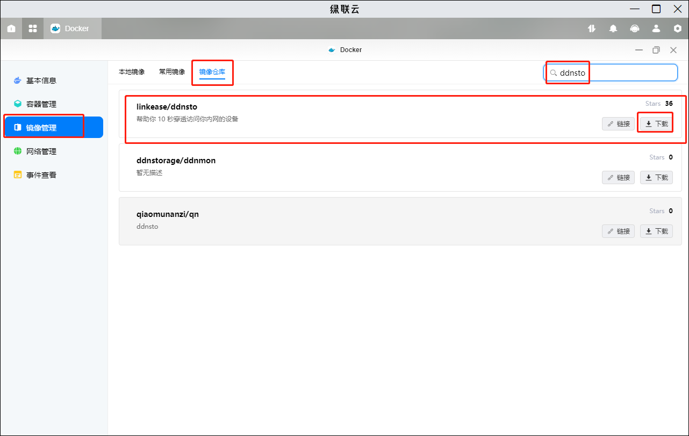
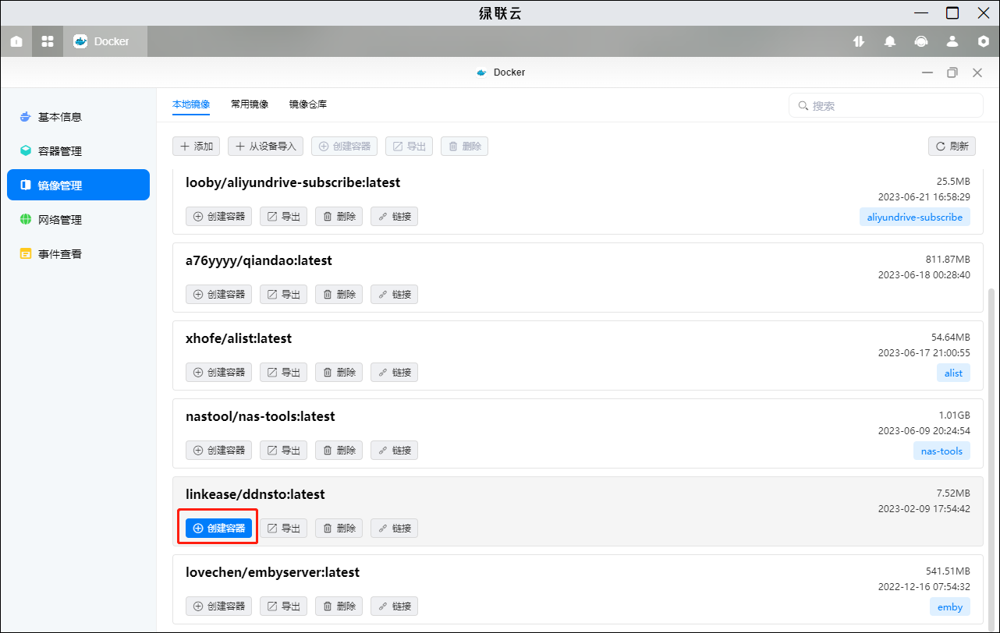
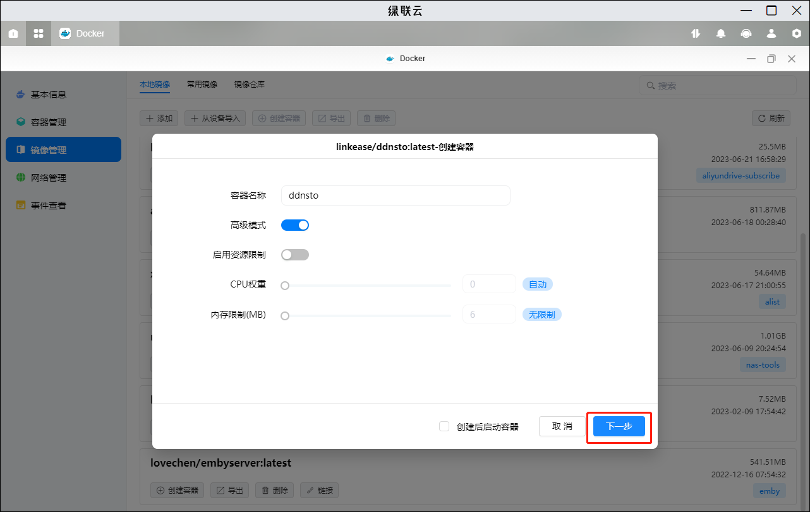
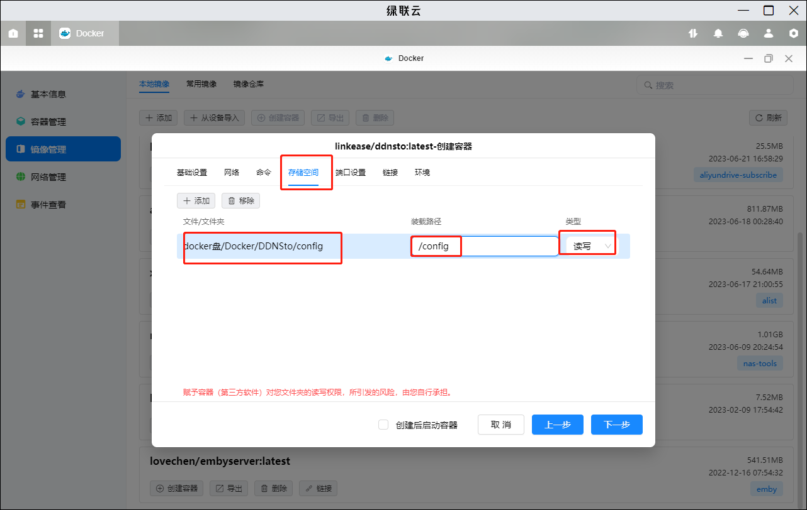
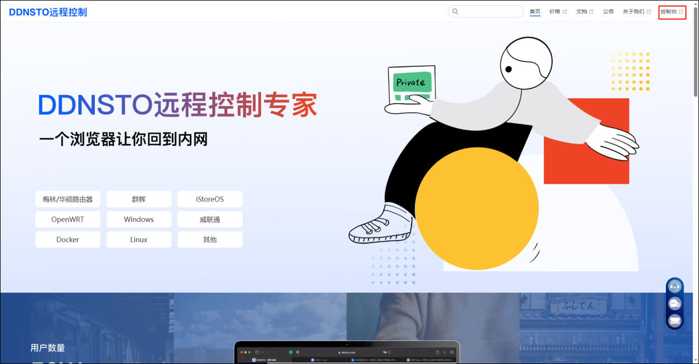
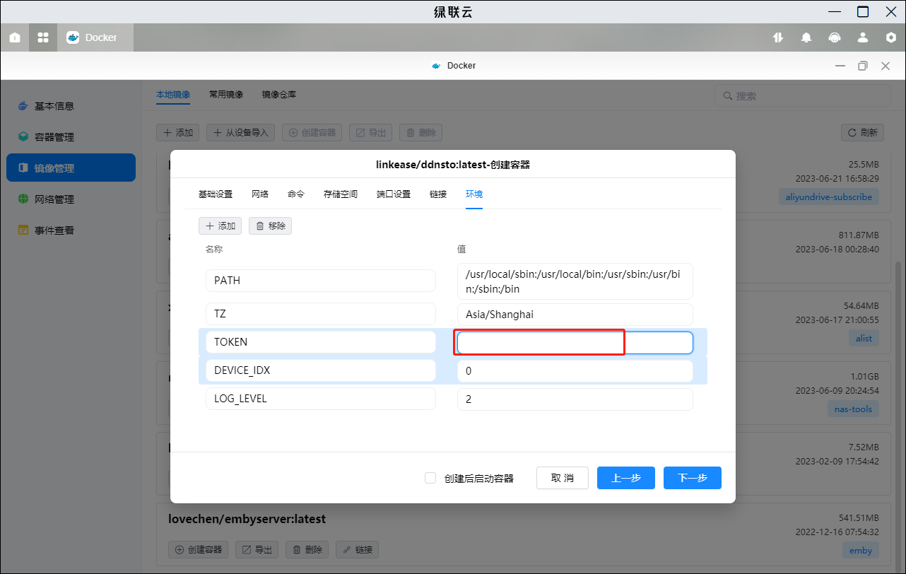
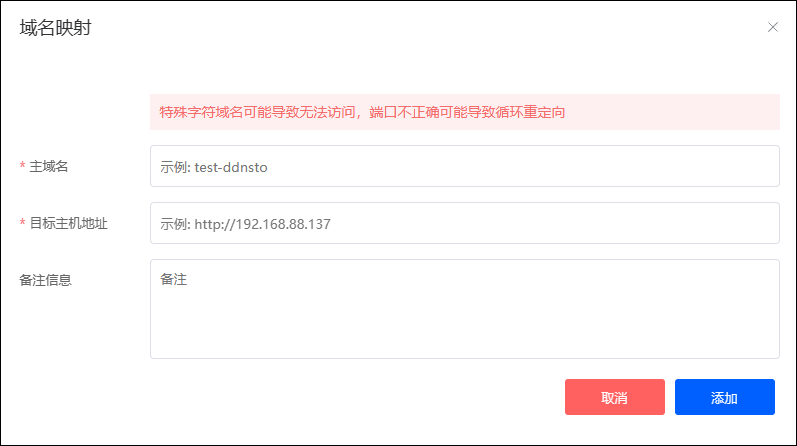

适用于无公网者使用，免费版适用于要求不高者。

## 1、拉取镜像

在 docker-镜像管理-镜像仓库旁边搜索框中搜索“ddnsto”，选择 linkease/ddnsto 这个镜像，点击下载，若无版本需求的话选择 latest 即可。

## 2、创建容器

1、下载完成后即可在镜像管理-本地镜像中找到，点击创建容器。

2、点击下一步。

3、点击存储空间。选择存放配置文件的文件夹，挂载路径填/config，类型选读写。

4、环境变量

首先在[ddnsto 官网](www.ddnsto.com)的控制台中获取令牌。

然后在 token 填入自己的令牌。

## 3、添加域名

进入 ddnsto 控制台，点击添加域名。填写域名映射：

- 主域名填写你想要使用的外网地址，比如 qbitorrent 可以设置成 xxxqb。
- 目标主机地址填写 docker 的内网地址+端口，比如 qbitorrent 可以设置成http://192.168.xx.xx:8080

填写完成后点击添加，稍等片刻后便可使用外网登录自己创建的域名来访问 nas 里的 docker。
