通过 DDNS-GO 和阿里云的免费域名部署动态解析，实现外网通过域名访问 NAS。

## 1、域名申请

首先我们确定阿里上我们已经上传了个人信息模板，并已经实名认证完成了。

1、打开[阿里 xyz 域名购买](https://wanwang.aliyun.com/domain/tld?spm=5176.17702883.J_1334179430.13.722d2f29cnWZto#.xyz)网站，输入你想购买的域名然后点击立即查询。旁边也可选择其它后缀，但是 6 位纯数字 XYZ 后缀的域名便宜，十年只需 68 块钱，具体的选择还是看你自己。

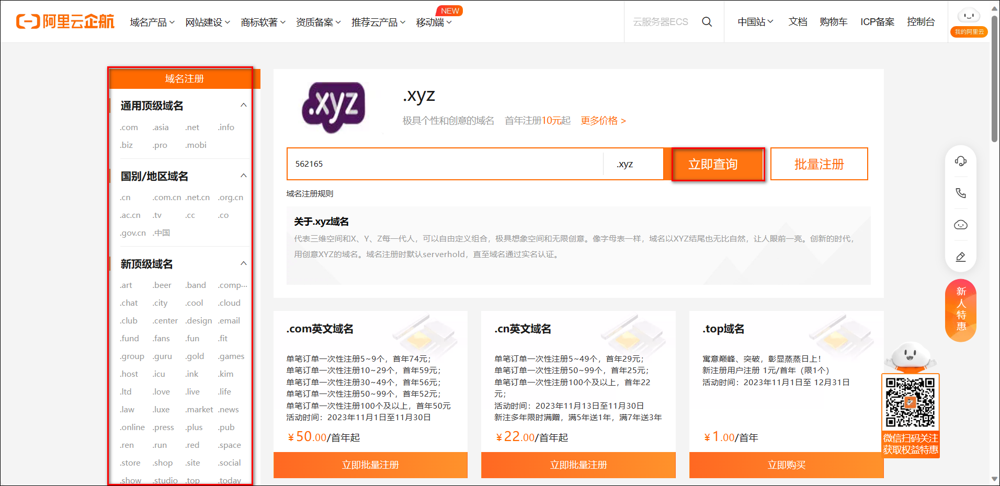

2、点击想购买域名后的加入清单，然后点击上面的域名清单。

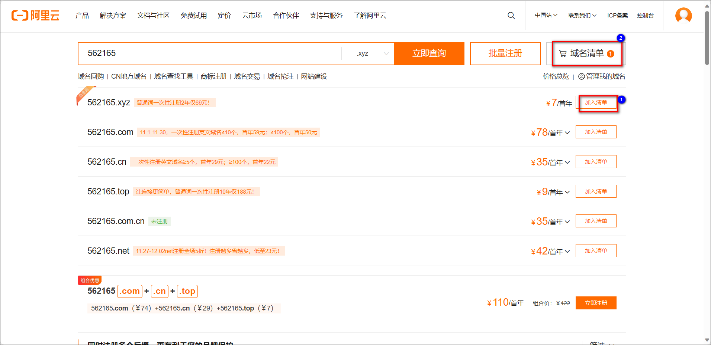

3、点击立即购买。

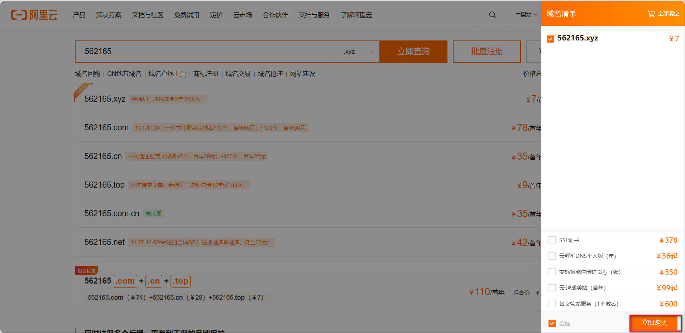

4、输入想购买的年限，并选择信息模板，勾选同意协定，点击立即购买。

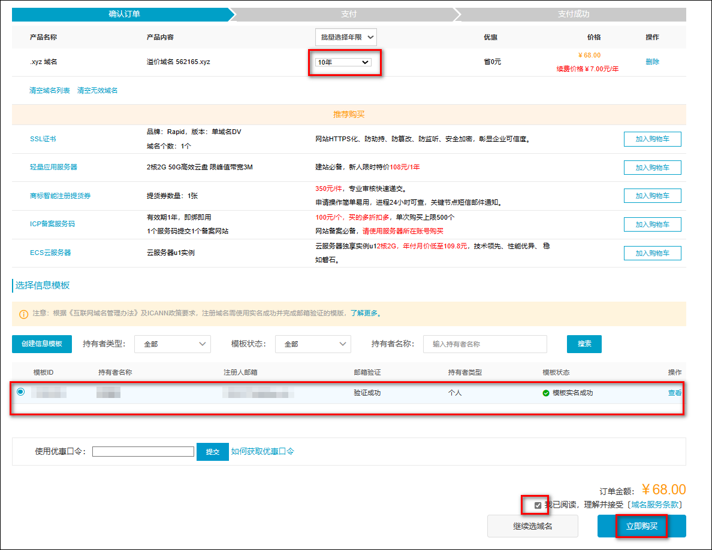

5、然后我们点击控制台，进入域名控制台下的域名列表，点击管理。

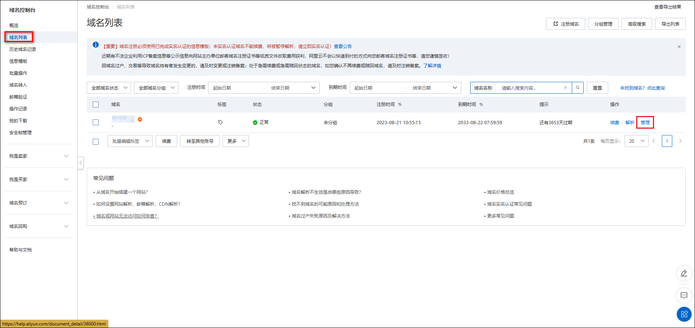

6、先在基本信息里看看自己的域名是否实名认证成功，因为没有认证成功是没办法进行域名解析的。这里我们是已认证的状态。

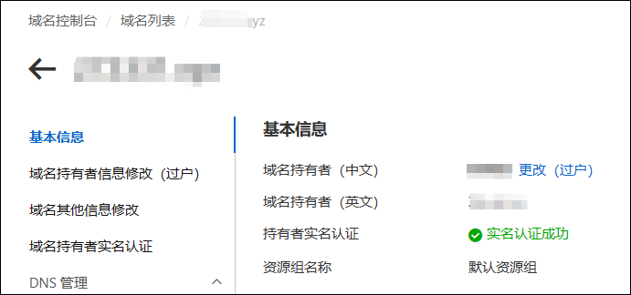

## 2、域名解析

1、点击进入域名解析。

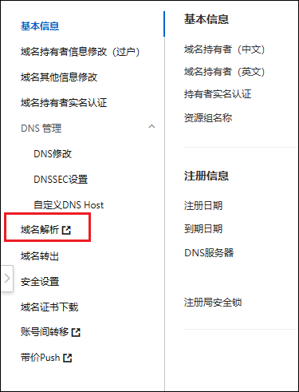

2、点击添加记录（如果有新手指引可以先跳过），设置二级域名。

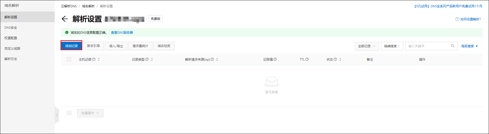

3、这里我们创建两个记录。

- 如果宽带 ip 是 ipv4，记录类型选择 A，宽带类型是 ipv6，记录类型选择 AAAA，这里大家根据自己的网络情况进行选择；主机记录选择@；记录值可以随便填一个进入比如 1.1.1.1（宽带是 V4 的），因为后面会实时更新；其他选项选择默认即可。
- 创建一个记录类型为 CHAME 的；主机记录选择\*；记录值填写我们申请的域名；其他选项选择默认即可。

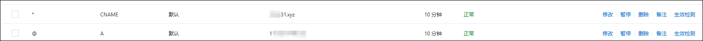

## 3、AccessKey 创建

我们把鼠标放在阿里云头像位置，会自动弹出菜单，选择 AccessKey 管理。

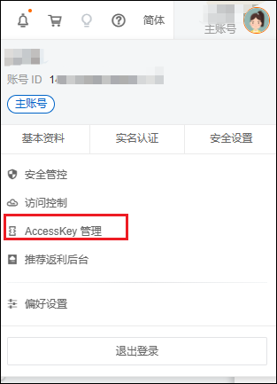

这时会弹出窗口，我们点击继续使用。

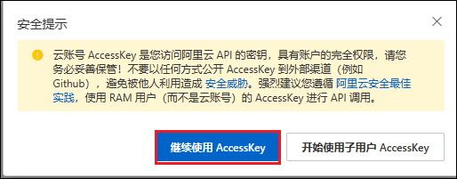

进入 AccessKey 管理界面，点击创建 AccessKey，然后选择验证方式进行验证。

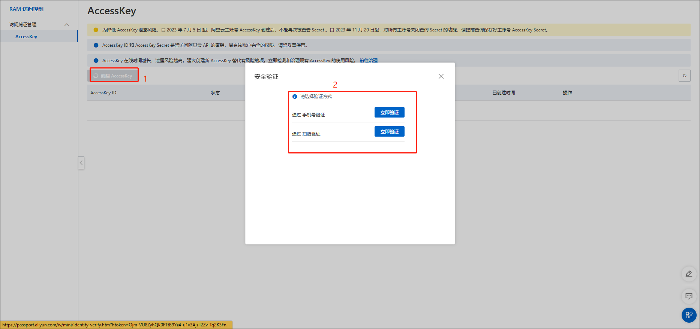

验证完后会自动生成一份 AccessKey 和 AccessKeySecret。这里注意要保存下来，否则后面没法再找回，只能重新创建。

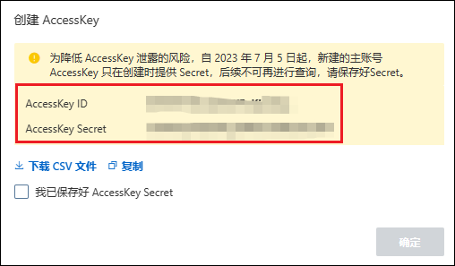

## 4、ddns-go 容器创建

进入绿联云 APP 的 Docker 镜像仓库，搜索 ddns-go。点击下载拉取最新版镜像。

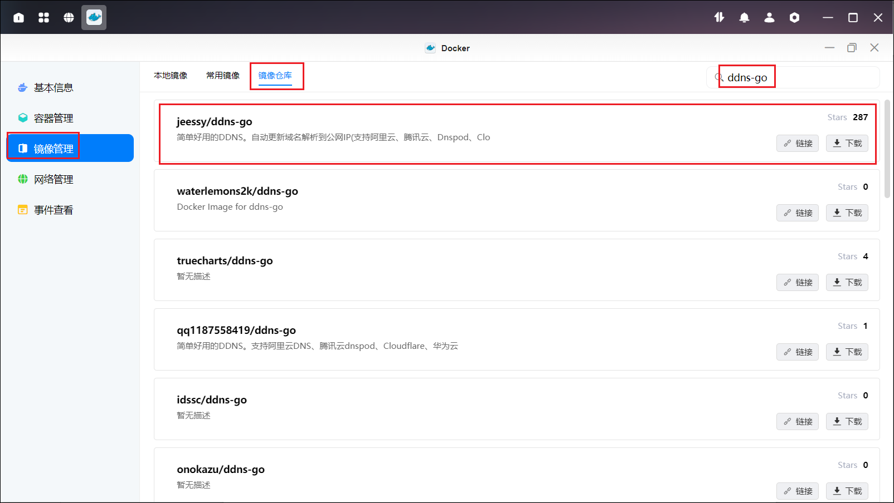

下载完后，在镜像管理找到刚下载的镜像，点击创建容器，勾选高级模式和创建后启动容器，点击下一步

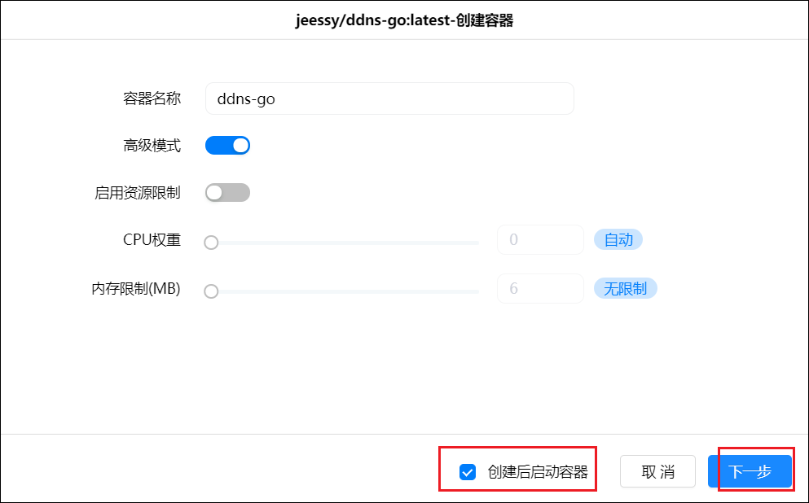

在基础设置里的重启策略选择重启策略。

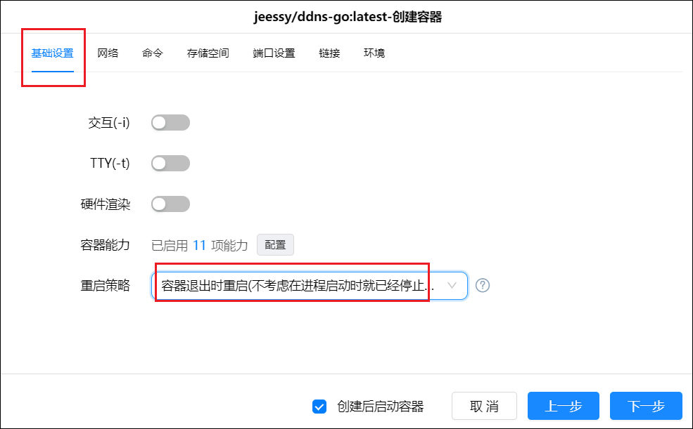

网络选择 host。

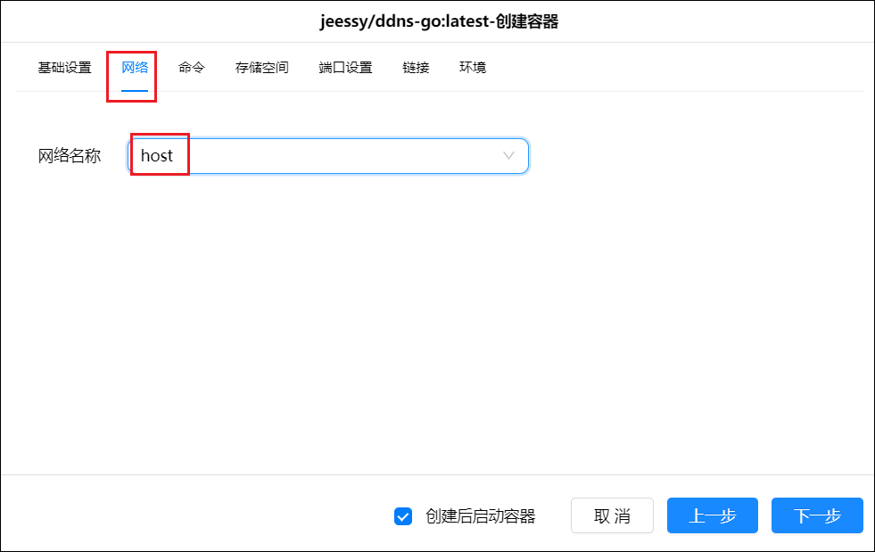

存储空间选择放置 Docker 的硬盘，新建文件夹 ddns-go 并选择它，完成挂载文件夹的填写，装载路径填“/root”，注意类型选择读写。

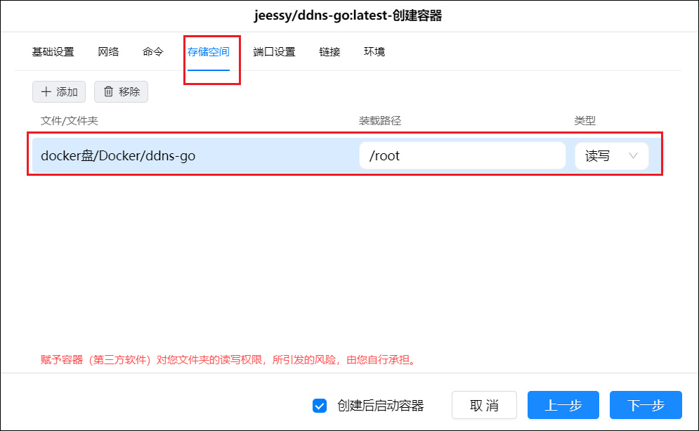

端口设置本地端口设置成跟容器端口一致，都填 9876。

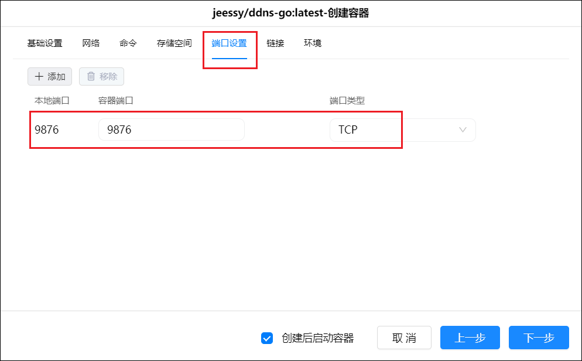

链接和环境不用设置，点击【下一步】后点击【完成】完成容器创建。

## 5、ddns-go 设置

创建完成后，在浏览器输入绿联 IP:9876，即可进入 DDNS-GO 的设置界面。选择阿里云，填入之前获取到的 AccessKey ID 和 AccessKey Secret。TTL 选择自动。

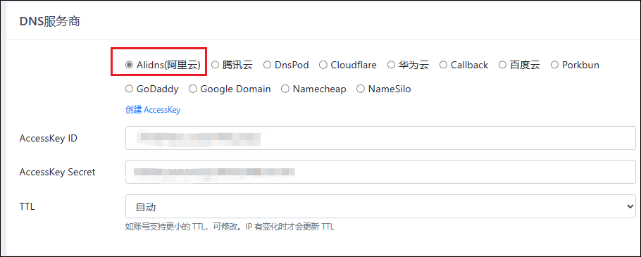

下面的 ipv4 和 ipv6 设置，大家根据自己的网络实际情况任选其一均可。Domains 这里因为我们解析的是一个@记录，所以这里填写@.域名。

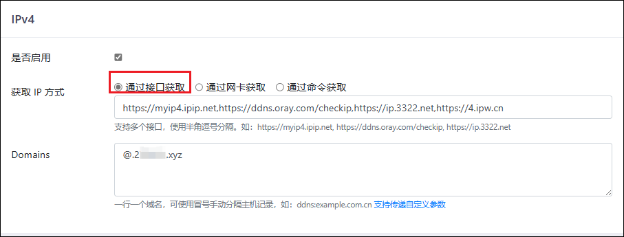

其他设置这里，可以自行选择是否禁止公网访问，一般不建议打开公网访问，因为 DDNS-GO 的动态解析只要设置一次后就会自动解析。当然，你也可以选择启用公网访问，只需要转发一下端口。另外这里也可以重新设置账号密码。全部设置完成之后，在下方点击 Save，就可以在日志里面看到解析是否成功的记录。

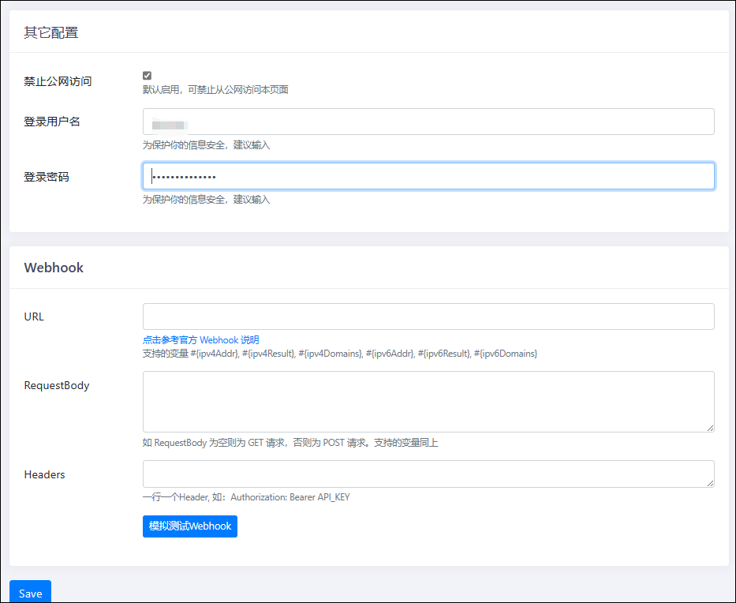
