通过DDNS-GO和阿里云的免费域名部署动态解析，实现外网通过域名访问NAS。

## 1、域名申请

首先我们确定阿里上我们已经上传了个人信息模板，并已经实名认证完成了。

1、打开[阿里xyz域名购买](https://wanwang.aliyun.com/domain/tld?spm=5176.17702883.J_1334179430.13.722d2f29cnWZto#.xyz)网站，输入你想购买的域名然后点击立即查询。旁边也可选择其它后缀，但是6位纯数字XYZ后缀的域名便宜，十年只需68块钱，具体的选择还是看你自己。

2、点击想购买域名后的加入清单，然后点击上面的域名清单。

3、点击立即购买。

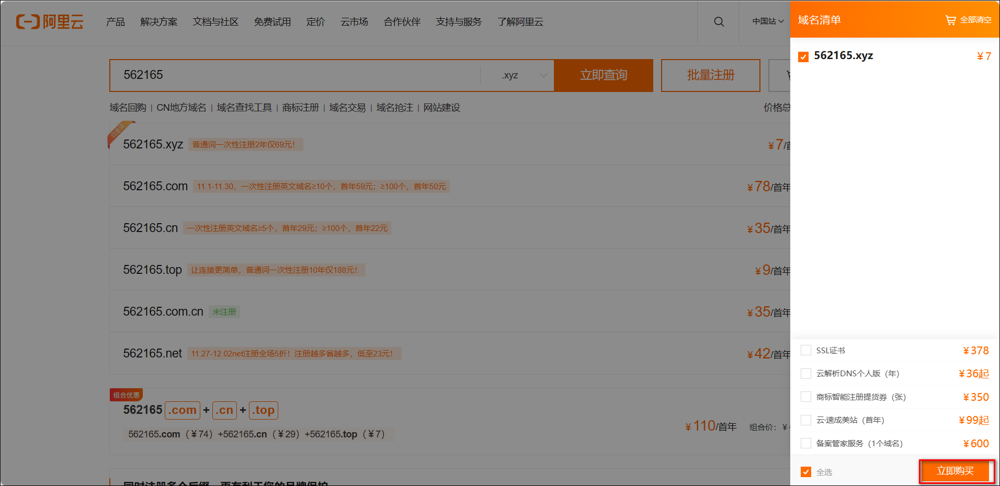

4、输入想购买的年限，并选择信息模板，勾选同意协定，点击立即购买。

5、然后我们点击控制台，进入域名控制台下的域名列表，点击管理。

6、先在基本信息里看看自己的域名是否实名认证成功，因为没有认证成功是没办法进行域名解析的。这里我们是已认证的状态。

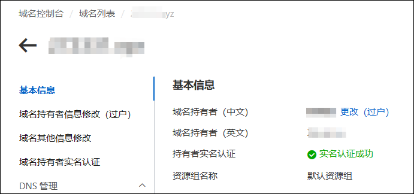

## 2、域名解析

1、点击进入域名解析。

2、点击添加记录（如果有新手指引可以先跳过），设置二级域名。

3、这里我们创建两个记录。

- 如果宽带ip是ipv4，记录类型选择A，宽带类型是ipv6，记录类型选择AAAA，这里大家根据自己的网络情况进行选择；主机记录选择@；记录值可以随便填一个进入比如1.1.1.1（宽带是V4的），因为后面会实时更新；其他选项选择默认即可。
- 创建一个记录类型为CHAME的；主机记录选择*；记录值填写我们申请的域名；其他选项选择默认即可。

## 3、AccessKey创建

我们把鼠标放在阿里云头像位置，会自动弹出菜单，选择AccessKey管理。

这时会弹出窗口，我们点击继续使用。

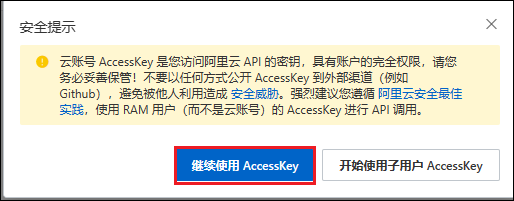

进入AccessKey管理界面，点击创建AccessKey，然后选择验证方式进行验证。

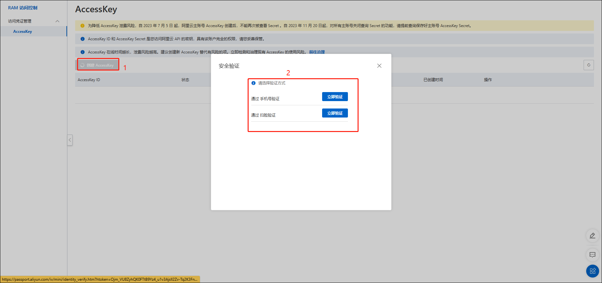

验证完后会自动生成一份AccessKey和AccessKeySecret。这里注意要保存下来，否则后面没法再找回，只能重新创建。

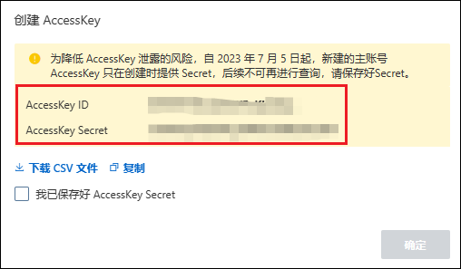

## 4、ddns-go容器创建

进入绿联云APP的Docker镜像仓库，搜索ddns-go。点击下载拉取最新版镜像。

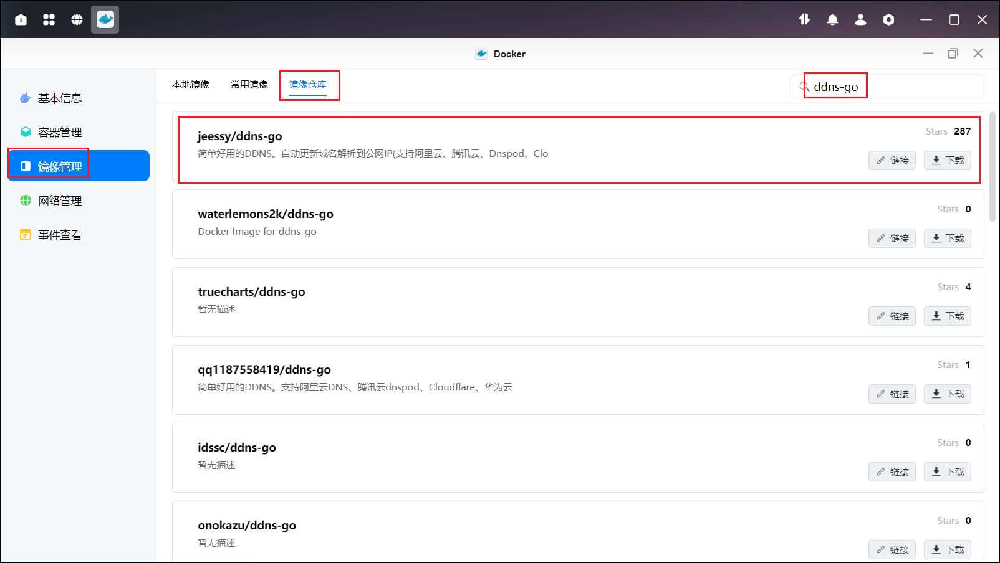

下载完后，在镜像管理找到刚下载的镜像，点击创建容器，勾选高级模式和创建后启动容器，点击下一步

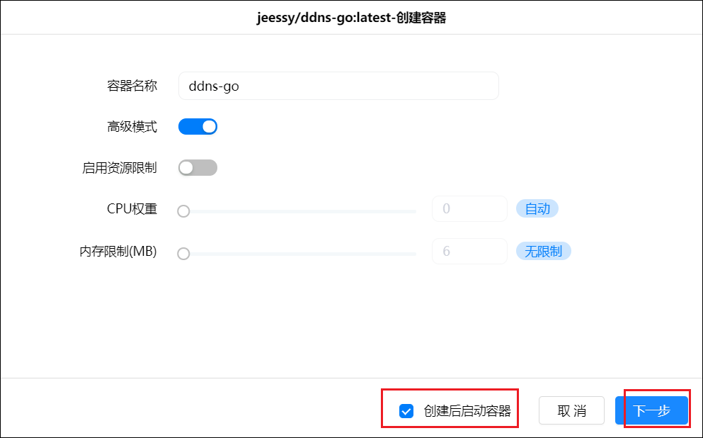

在基础设置里的重启策略选择重启策略。

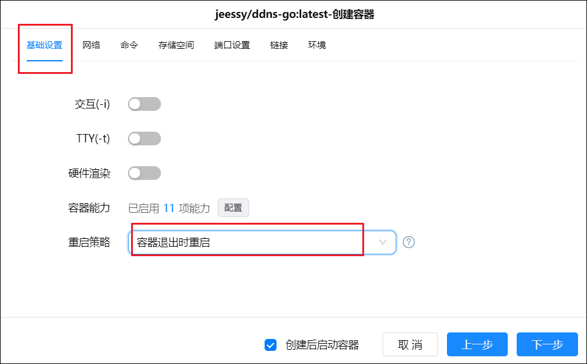

网络选择host。

存储空间选择放置Docker的硬盘，新建文件夹ddns-go并选择它，完成挂载文件夹的填写，装载路径填“/root”，注意类型选择读写。

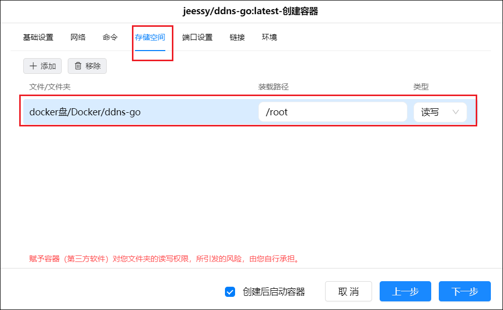

端口设置本地端口设置成跟容器端口一致，都填9876。

链接和环境不用设置，点击【下一步】后点击【完成】完成容器创建。

## 5、ddns-go设置

创建完成后，在浏览器输入绿联IP:9876，即可进入DDNS-GO的设置界面。选择阿里云，填入之前获取到的AccessKey ID和AccessKey Secret。TTL选择自动。

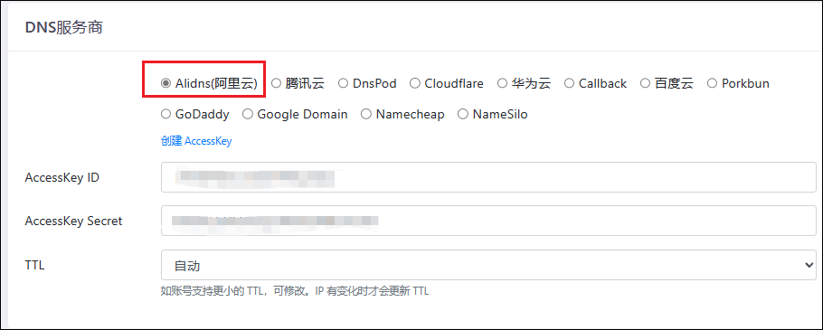

下面的ipv4和ipv6设置，大家根据自己的网络实际情况任选其一均可。Domains这里因为我们解析的是一个@记录，所以这里填写@.域名。

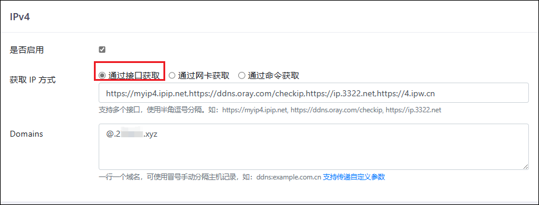

其他设置这里，可以自行选择是否禁止公网访问，一般不建议打开公网访问，因为DDNS-GO的动态解析只要设置一次后就会自动解析。当然，你也可以选择启用公网访问，只需要转发一下端口。另外这里也可以重新设置账号密码。全部设置完成之后，在下方点击Save，就可以在日志里面看到解析是否成功的记录。

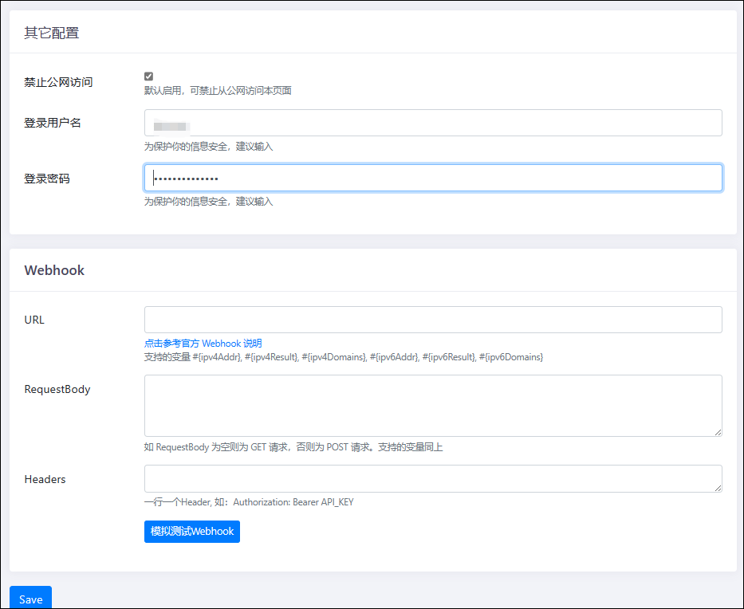

