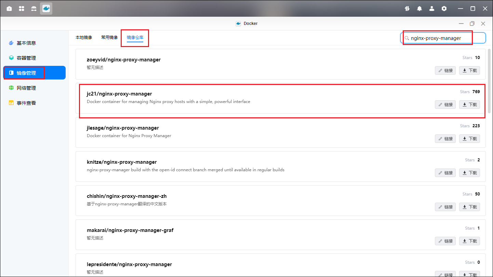
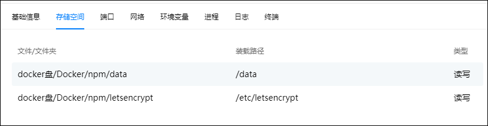
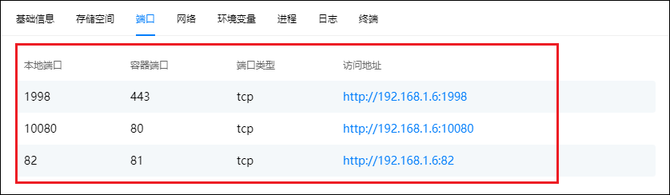
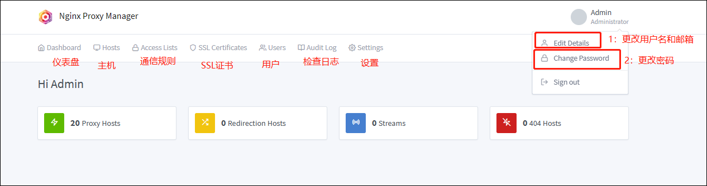
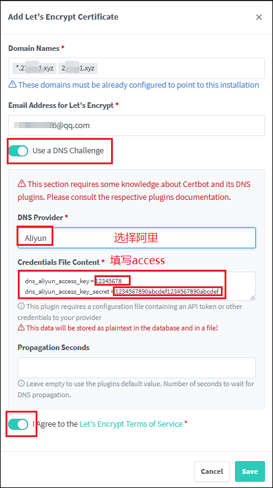
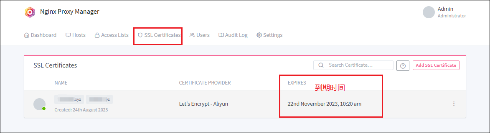
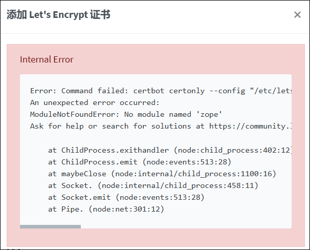
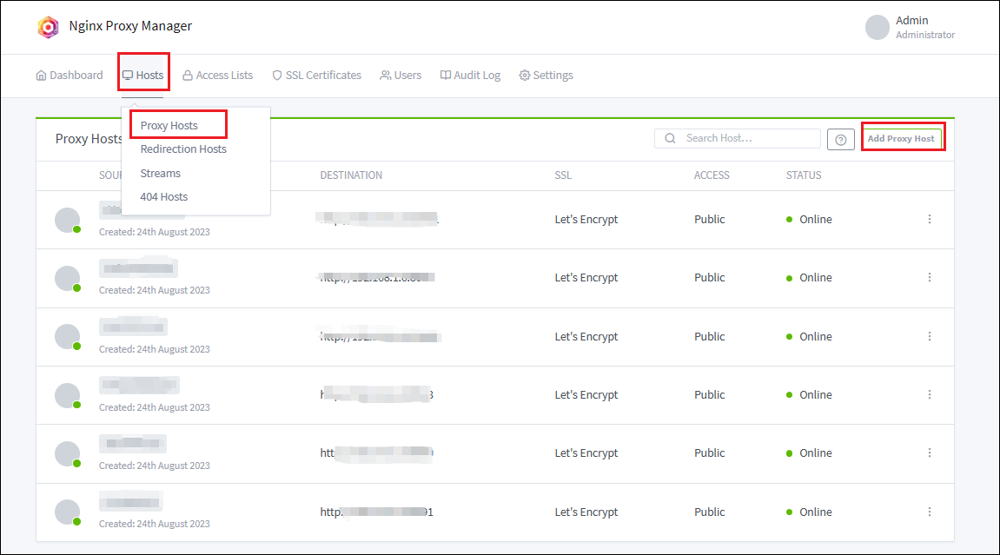
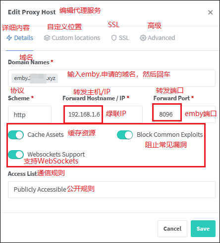
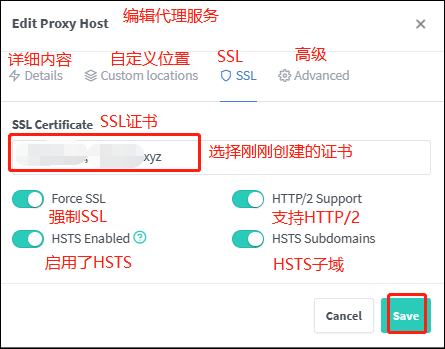

## 容器部署

1、在绿联的镜像仓库里搜 nginx-proxy-manager，并安装最新版本。

Ps：如果想安装中文版的话可以安装 nginx-proxy-manager-zh 版本，这个版本是国人翻译的中文版。

2、创建容器

1）存储空间设置

2）端口设置:

因为家宽默认是封 80 和 443 的端口的，所以我们本地端口都改了。这里的 1998 对应 443，是我们外网访问时需要映射的端口，可根据个人喜好填写。1998 也是我们需要到路由器端口转发中映射出去的端口。

## npm 设置

### 初始化

浏览器输入绿联 ip:端口进入 npm，默认的账号为admin@example.com，默认的密码是：changeme。

登入后点击右上角的头像，然后点击 1 可以修改用户名和邮箱，点击 2 可以修改密码，首次进入推荐更改账号以及密码。

### SSL 证书

点击 SSL 证书（SSL Certificate），然后点击创建证书，并按要求输入内容，输入完成后点击 save 保存。

- 域名（Domain Names）：填写两个，一个直接填写你申请的域名，一个填写【\*.申请的域名】。
- 填写对应的邮箱地址，勾选【使用 DNS 认证（Use a DNS Challenge）】。
- DNS 提供者（DNS Provider）选择你申请的域名服务商，比如阿里。
- 证书内容（Credentials File Content）里把=后面的内容换成你自己的 access_key。
- 等待时间（Propagation Seconds）可默认不填。
- 勾选同意条款。

添加完成后需要等待一会，就可以看到我们添加成功的证书。由于这是免费的泛域名证书，有效期只有三个月，所以有个到期时间，到期后我们就需要来重新申请一次证书。

如出现如图错误：

则我们需要下载一个 zope 模块，等待下载完成后再去 Nginx-Proxy-Manager 后台点击保存确认，即可申请到证书。

### 反代端口

点击 Hosts（主机），选择 Proxy Hosts（代理服务），添加然后在 Proxy Hosts（代理服务）页面点击 Add Proxy Hosts（添加代理服务）。

主要设置以下两项：

1）Details

以 emby 为例：这里的域名是二级域名可随意填写，只要后缀是自己的域名就可以，比如 emby.域名；协议就是 http；转发主机就是绿联的 IP；转发端口就是你需要转发的容器服务比如 emby 对应的端口；然后勾选下面三项内容。

2）SSL

点击 SSL，勾选刚才申请的证书和下面四项内容。

