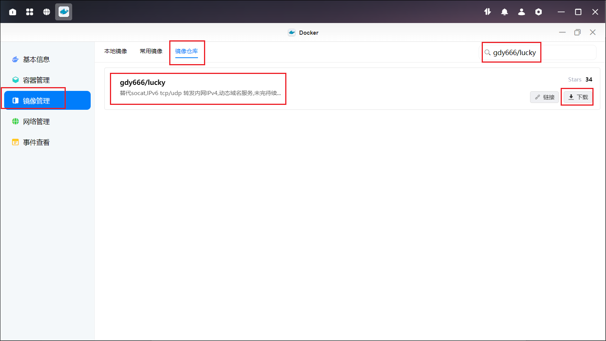
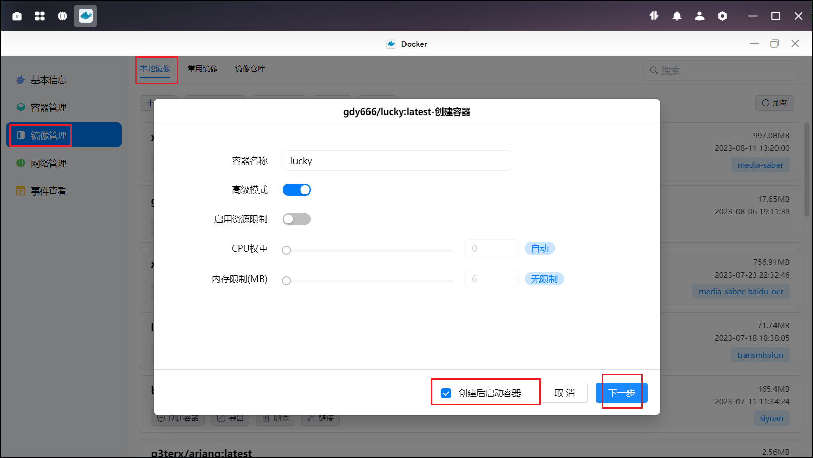
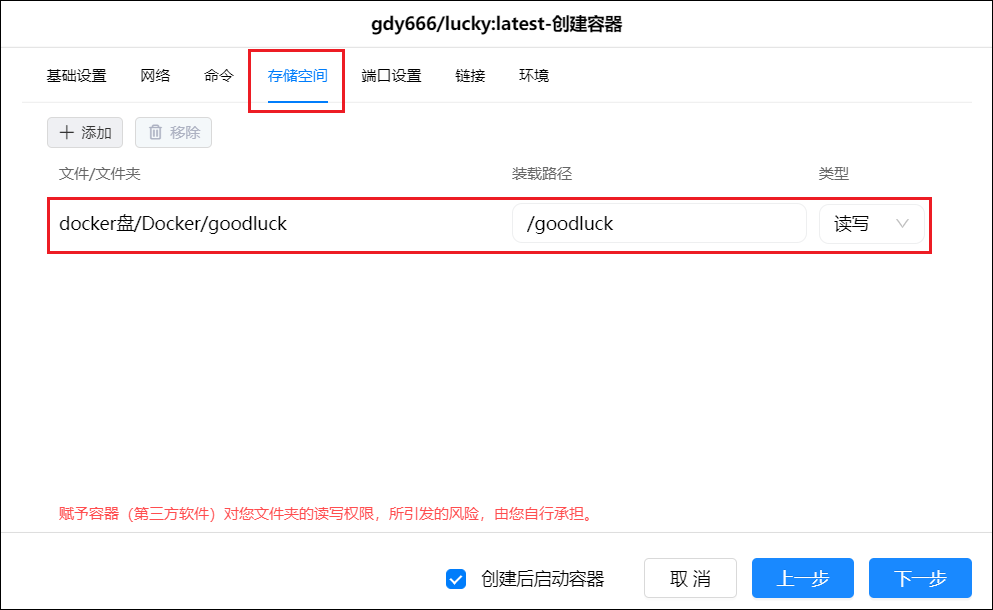
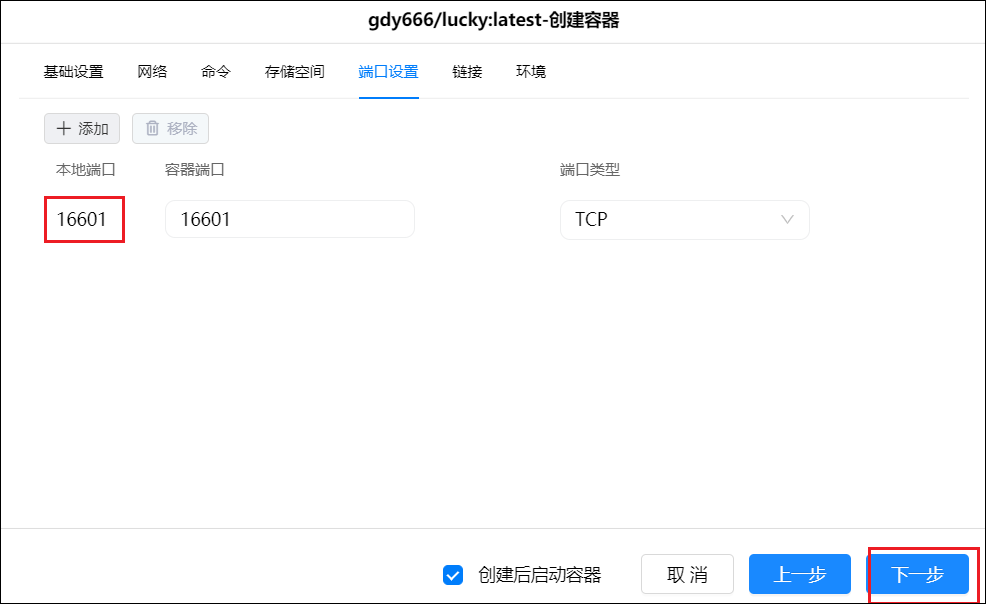
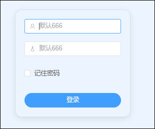
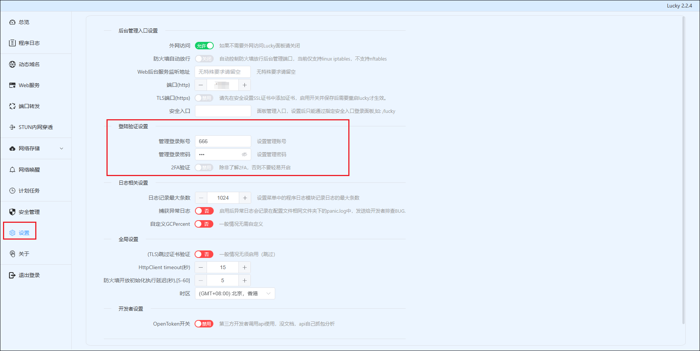
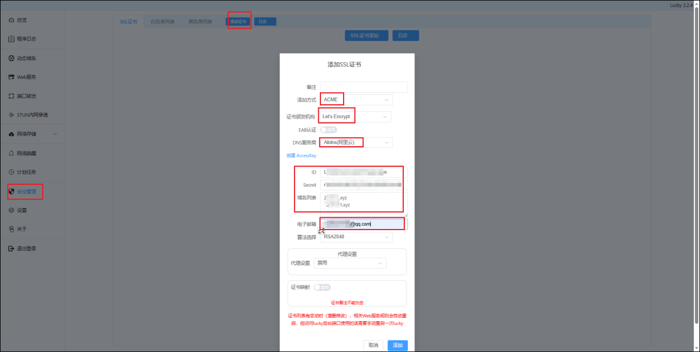
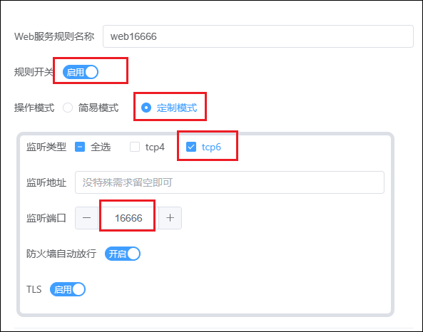
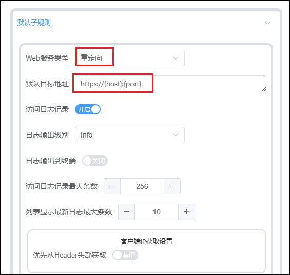
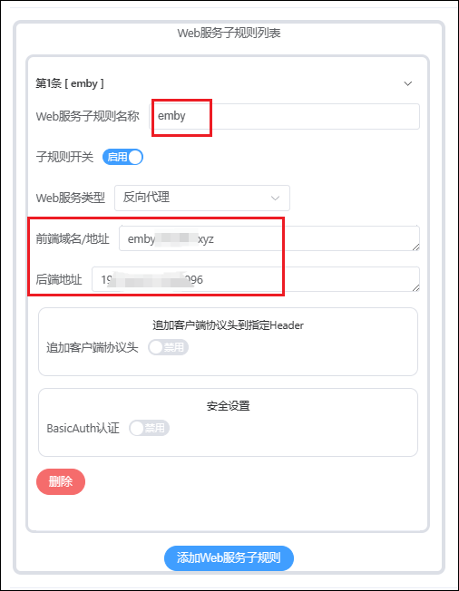

lucky 是一个网络设置小工具组，支持可视化操作，自带 WebUI 后台。支持 IPv6/IPv4 端口转发、反向代理、动态域名、语音助手网络唤醒、IPv4 内网穿透、计划任务和自动证书等多项功能。

## 容器部署

1.首先我们打开绿联云，来到 Docker 拉取镜像：gdy666/lucky，安装最新版本。

2.点击创建容器，勾选创建后启动容器，点击下一步。

3.重启策略选择容器退出时总是重启容器

4.网络选择：host

5.在 Docker 目录下新建个 goodlucky 文件夹设为挂载文件夹，挂载路径为/goodluck，类型设置读写。

6.端口默认为 16601， 然后直接点下一步，然后点完成启动应用.

7.打开浏览器输出你的 NAS 的 IP 加端口 16601 进入设置界面，默认账户为 666 密码为 666

8.然后进入网页

## 配置

### 1、修改账户密码

设置-登录验证设置修改账户密码。

### 2、域名解析

点击动态域名-添加 DDNS 任务，进行域名解析。

- 除非特殊需求一般简易模式就够你用了，不要点定制模式
- DNS 服务商根据你的服务商选择，这边我们用的是阿里云，并输入对应的 AccessKey ID 和 Secret。
- 公网 IP 类型根据你自身是 IPV4 还是 IPV6 选择，如果是 IPV4 就选择接口获取，如果是 IPV6 就选择网卡获取（你两个都要解析需要创建两个）；域名列表里假如你的域名是 abc.com，那么下面填写 abc.com 和\*.abc.com

填写完成等一会，会出现同步结果，如果不一致会失败，自查原因

### 3、SSL 证书

点击安全管理-添加证书

- 添加方式选择 ACME
- 证书颁发机构选择 Let's Encrypt
- DNS 服务商选择阿里云
- 域名还是如上填写 abc.com 和\*.abc.com
- ID 和 KEY 是阿里云获取的
- 邮箱是自己的邮箱，其他全部默认。

保存后等一会，如果成功后会出现泛域名证书到期时间，这个是自动续签的。

### 4、反代

接着我们来到 web 服务-添加 web 服务规则。

1）监听类型 tcp4 对应 IPV4 ，tcp6 对应 IPV6，你解析的是啥就选啥，监听端口是你反代的端口，这边我们用 16666 为例（你可以随意，只要端口没被占用重复），需要关闭防火墙自动放行，因为我们是在 NAS 中使用，用不到这个（大部分地区 80/8080/443 端口都是封掉的状态，如果 443 没有被封，你可以监听 443，就可以只写二级域名且不需要写监听端口）

2）点击默认子规则，把 web 服务类型选择重定向，默认目标地址写 https://{host}:{port} 如果你是 443 监听就写 https://{host}。

3）然后点击下面的添加 web 服务子规则，以 emby 为例，这边我们前端域名就是你的二级域名，因为前面我们已经写了\*.abc.com，所以这边我们就直接写一个二级就行如：emby.abc.com，后端地址就是你的 emby 内网地址，比如我的是 192.168.31.120:8096，然后保存即可。这里你有几个服务需要外网访问就创建几个子规则，反代监听端口都是一样的，只不过二级域名不同而已。

### 5、转发端口

这边因为我们是在 NAS 搭建的 Lucky 所以需要将反代监听端口 16666（跟随上面你设置的反代监听端口号）转发出去，然后可以通过 https：//emby.abc.com：16666 外网访问你的 emby 了
