## 镜像下载

在绿联 NAS 操作面板中找到 docker-镜像管理，搜索 natfrp/frpc，安装最新版本（latest）。

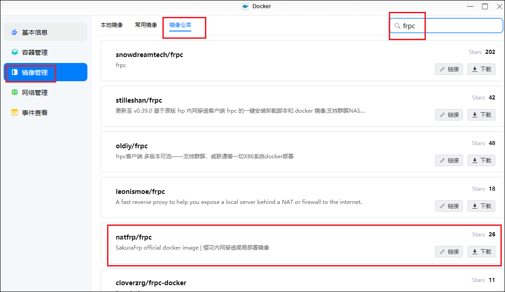

## 创建隧道

1、打开 docker - 网络管理，记录下 bridge 的网关 IP，即 172.17.0.1。

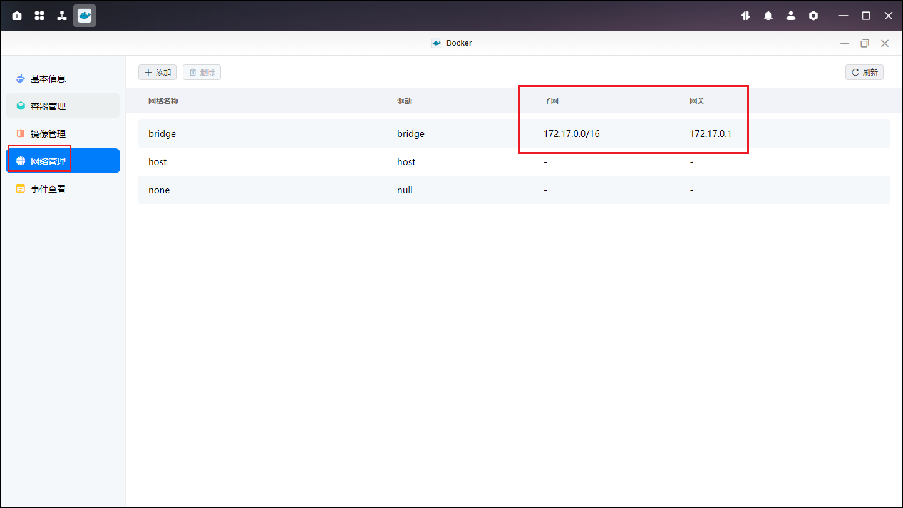

2、进入 [SakuraFrp 官网](https://openid.natfrp.com/)，注册账号。

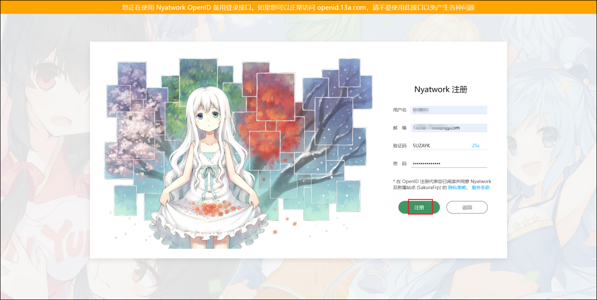

3、点击 Sakura Frp。

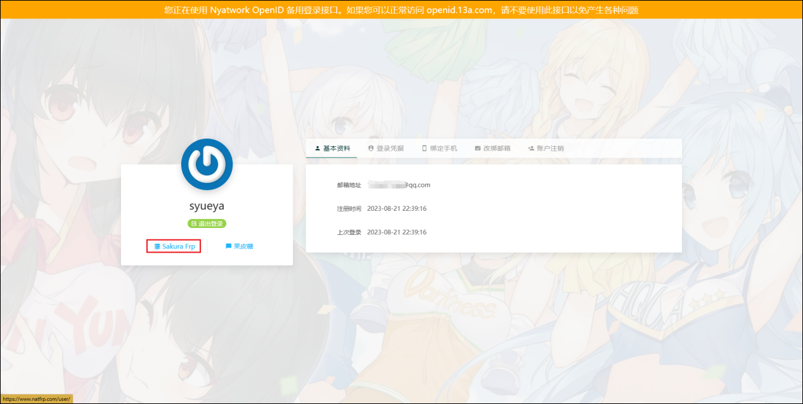

4、进入界面后打开服务 - 隧道列表。

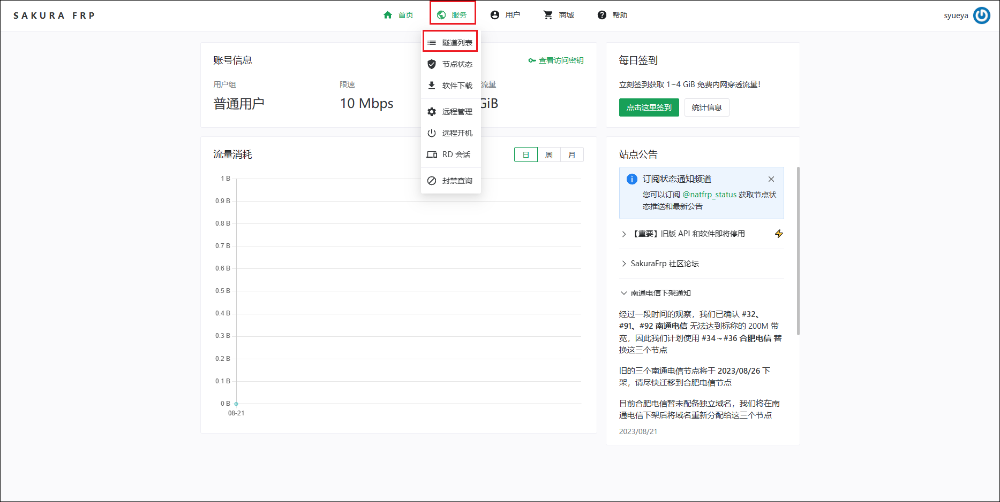

5、按需创建一个隧道

- 示例穿透网页应用，故使用 TCP
- 隧道名自定义，备注自定义
- 本地 IP 填上面记下的网关 IP（此处为 172.17.0.1），本地端口填您需要穿透的 docker 容器端口
- 示例所用 qb 的本地端口为 8080，所以 SakuraFrp 设置中的本地端口也填写 8080

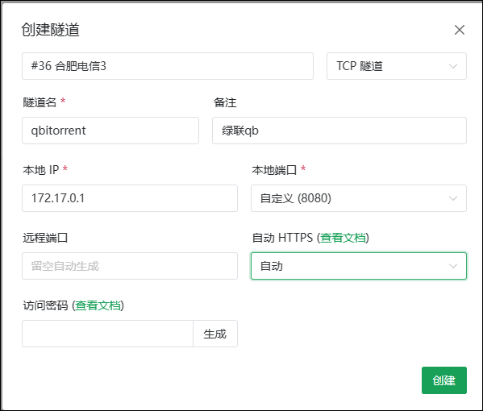

6、配置完后，点击创建（需支付 1 块钱通过支付宝实名认证）。创建成功后，点击右侧三个点，选择配置文件：

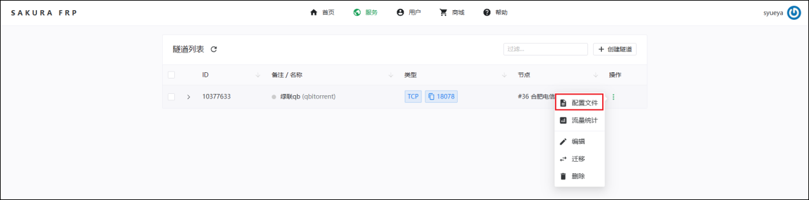

7、记录下这里的 token 和隧道 ID。 token 是您在 SakuraFrp 的身份令牌，注意不要泄露。

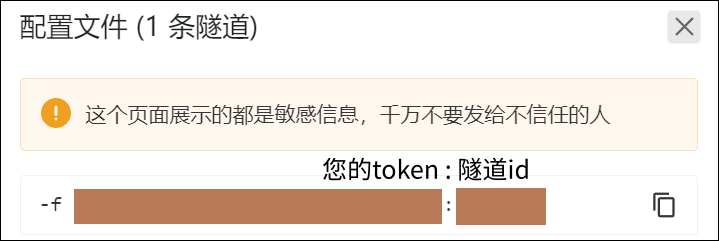

## 创建容器

点击镜像管理 - 本地镜像，选择刚刚下载的 natfrp/frpc 容器，点击创建容器，前面的设置都无需改动，只需要在环境下填写下刚刚获取的 token 和隧道 ID。修改完毕后，点击下一步 - 确认创建容器。

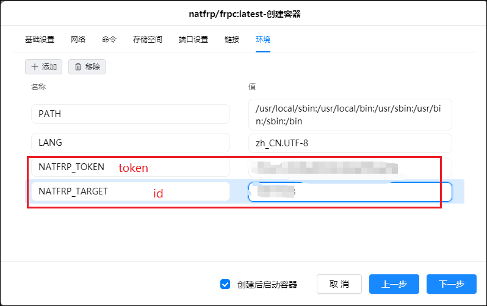

## 使用

1、容器启动后，点击详情。

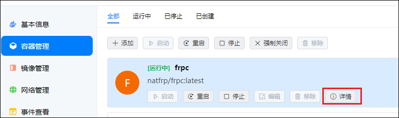

2、如果一切顺利，在日志里，您可以看到两个链接选项。在链接前面加上 https://，即可访问穿透端口了。

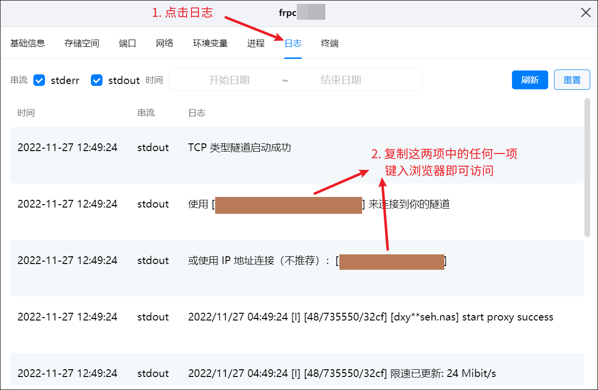

3、如图，qBittorrent 穿透完成，成功使用 SakuraFrp 的链接打开 qb 的 WebUI：

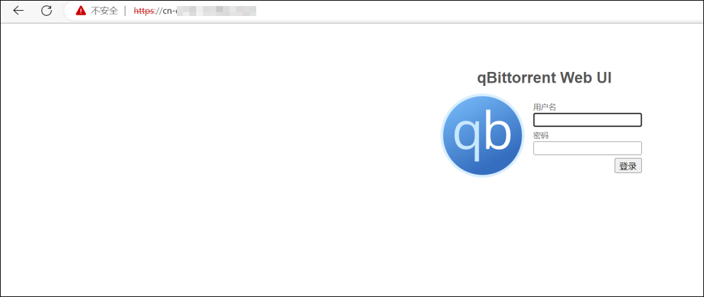
