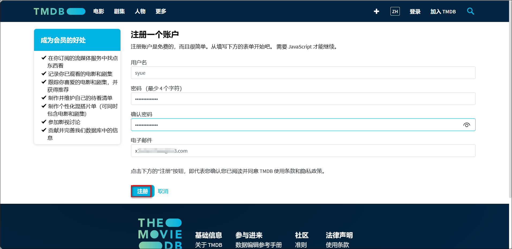
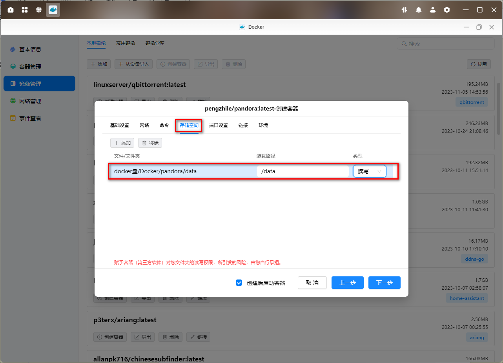
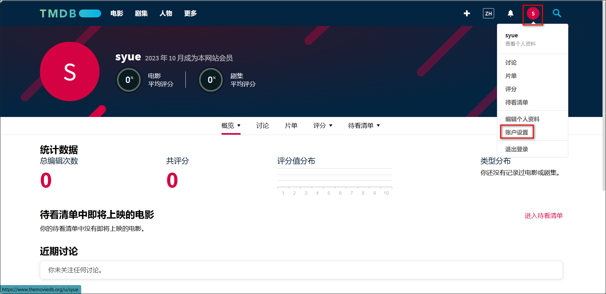
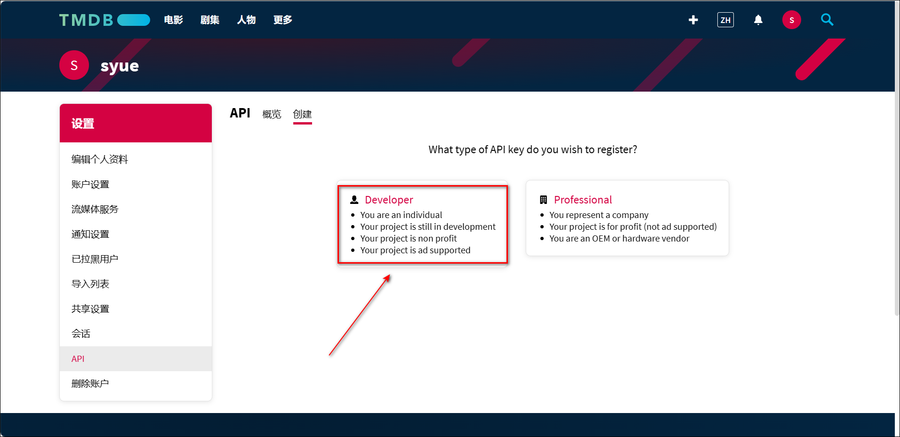
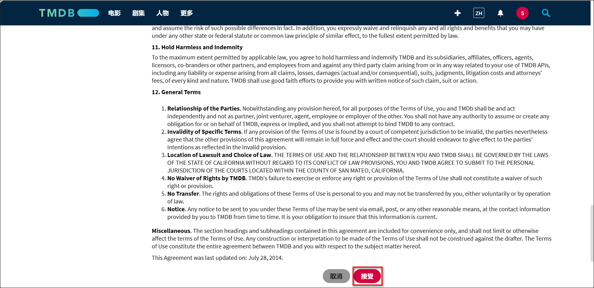
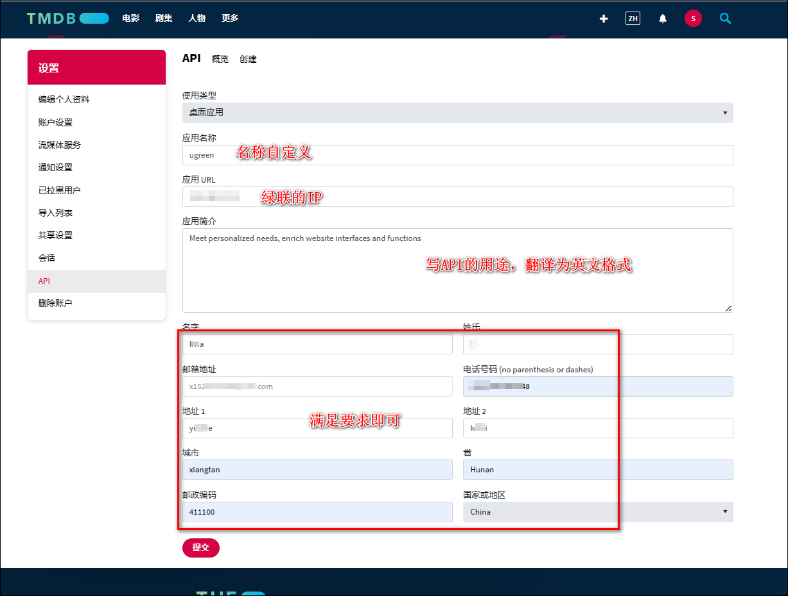
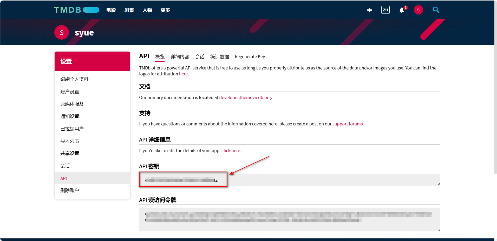

1、点击进入[TMDB 官网](https://www.themoviedb.org/)，点击【加入 TMDB】。

2、按照要求输入相关信息完成注册。

3、注册完成以后会收到封验证邮件，点击 ACTIVATE MY ACCOUNT 激活账户。

4、登录 TMDB。

5、点击右上角的头像-帐户设置。

6、点击左侧的 API，然后点击请求 API 秘钥下面的 click here。

7、点击开发者（Developer）。

8、协议滑动到最后选择接受。

9、名称自定义，应用 URL 填写绿联 IP，应用简介按照写 api 用途（最好填写英语，百度翻译即可）然后点击提交。

> 应用简介参考（填写英文部分）：满足个性定制化需求，丰富网站接口以及功能（Meet personalized needs, enrich website interfaces and functions）。

10、这样我们就获取到了 TMDB 的 API 密钥，复制下来保存，后面我们会用到。

